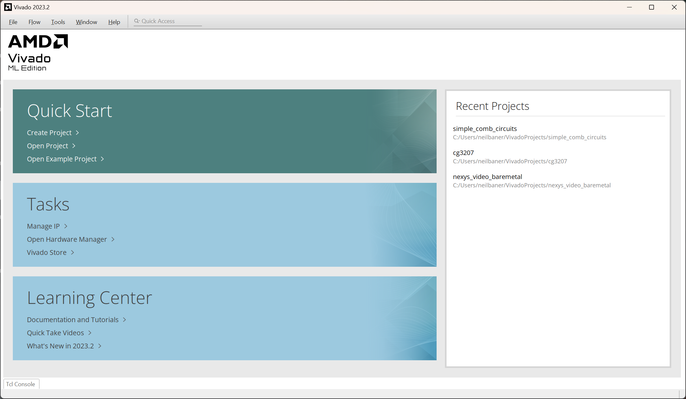
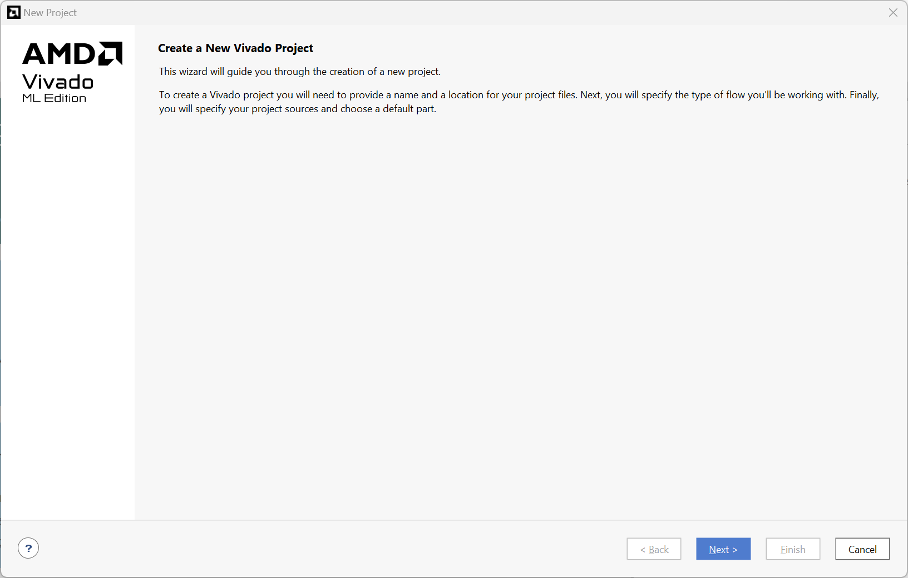
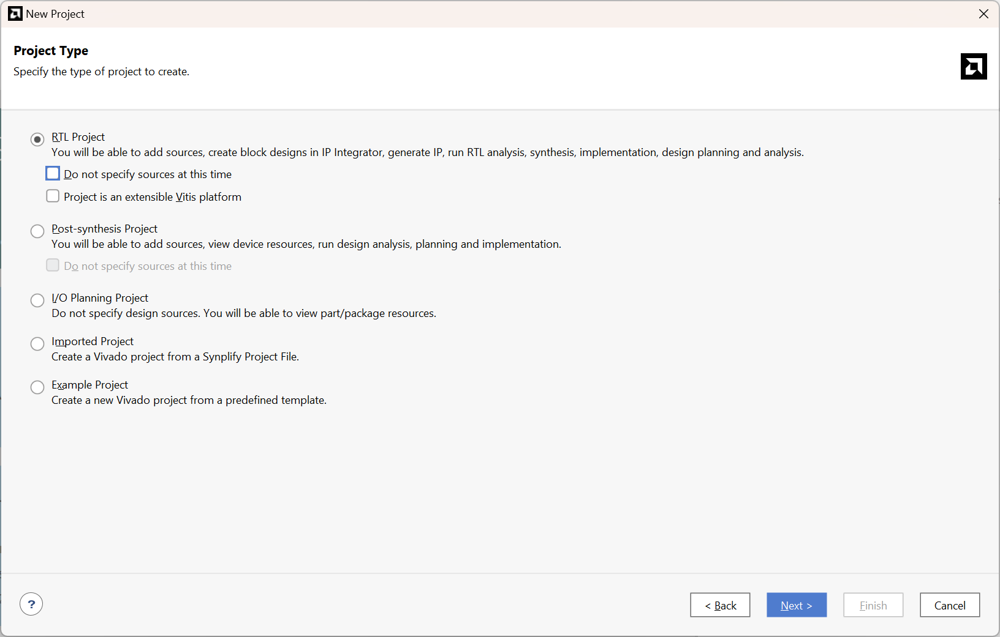
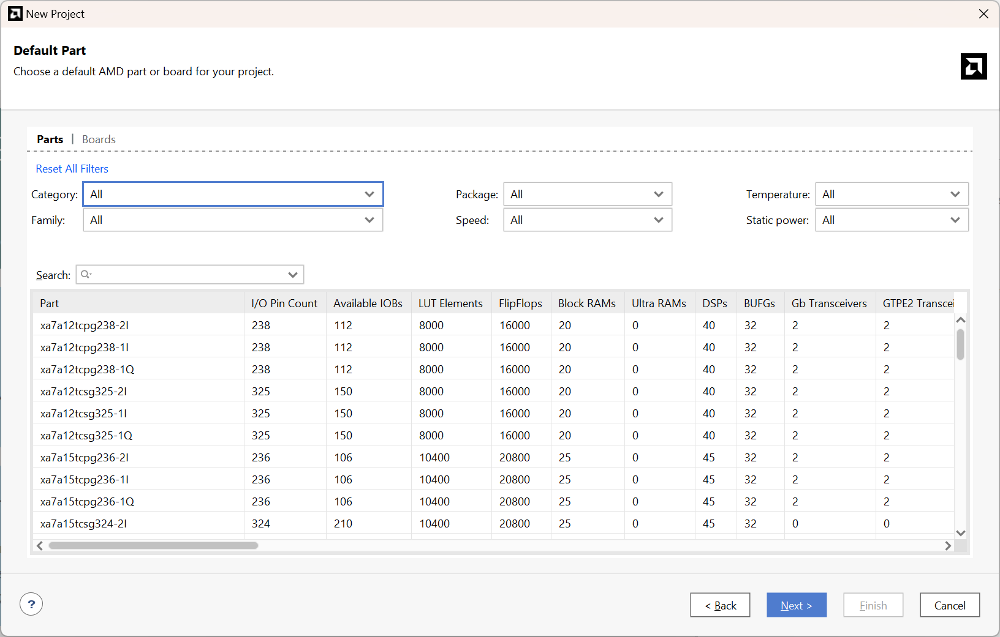
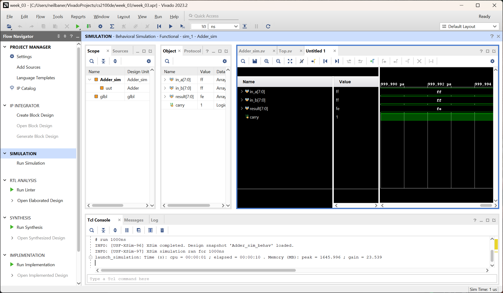
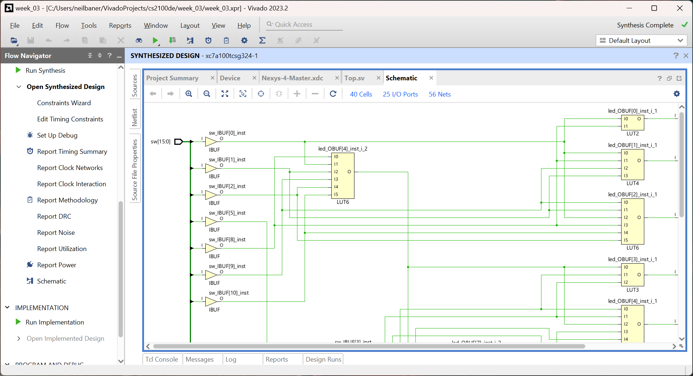
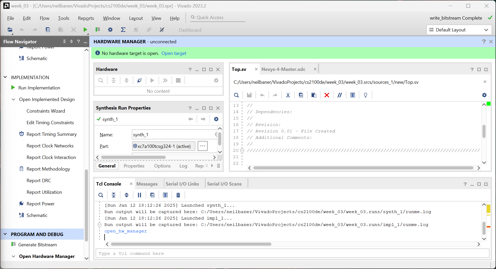
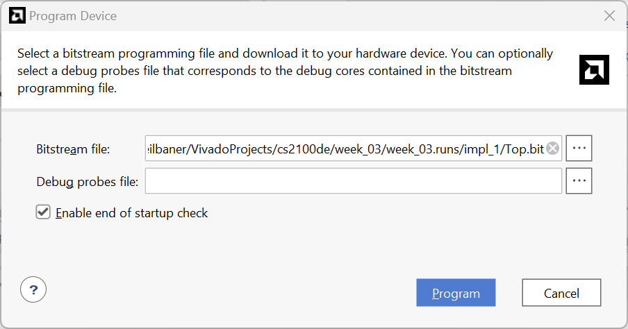

# Lab 1 : Getting familiar with FPGA tools

!!! info "Graded Lab Assignment" 

	This lab includes a graded lab assignment, worth **2 points**. Refer to [the page on grading](../../grading.md) for more information. 

	This assignment includes **4 questions**, clearly demarcated throughout the manual. 

## Introduction

In this lab, we will learn what an FPGA is, and use our FPGA board to learn how to design digital logic for, and program, an FPGA. We will use an FPGA for the final project for this course, where you will build a simple CPU, so it's important to be very comfortable using this powerful tool. 

You should have read the [Getting to know your Nexys 4](../../guides/nexys4.md) page before starting this lab. If you have not done so, please do so now. It is very important for you to know your equipment. 

To download the files you need, visit the [lab_templates](https://github.com/NUS-CS2100DE/labs/tree/main/lab_templates) folder in the GitHub repository. 

### What is an FPGA?

We've thrown around the term FPGA a lot so far, and even mentioned that it stands for Field Programmable Gate Array. But what exactly does that mean? 

An FPGA is a device digital designers use to build and/or prototype digital logic circuits. As mind-blowing as it sounds, when we make a design on an FPGA, we actually change the internal structure of the chip to produce the logic that we want(1). It's kind of like a Lego set - we can connect different types of bricks (digital logic components) in different ways to build all sorts of structures (digital circuits). 
{.annotate}

1. This is a simplification of what really happens when we program an FPGA. In reality, FPGAs are like any other chip, with a fixed number of components which can't change. However, using a configurable network of interconnects, the connections between these components can be set to our liking, allowing us to build logic devices and circuits. To learn more about the weird and wonderful world of FPGAs, you can take [EE4218](https://nusmods.com/courses/EE4218/embedded-hardware-system-design) and learn more. 

Knowing this, the name Field Programmable Gate Array now makes more sense. "Field Programmable" refers to the fact that we can easily reprogram the chip without needing to take it off the board or doing anything too complicated. "Gate Array" refers to the fact that the chip is made of a large array of digital logic gates, which can be connected in (almost) any way we want. 

??? note "A note on semantics"
	Strictly speaking, the term FPGA is used to refer to the chip on, say, our Nexys 4 board - the one in the center which says "Artix-7" on it. The Nexys 4 as a whole is an FPGA development board. Sometimes, we may refer to the whole board as an "FPGA" - this is technically incorrect. Similarly, an Arduino is a microcontroller development board, not a microcontroller; the Atmega 328P chip on the Arduino is the microcontroller. 
	
	In this website, we have made every effort to *not* be technically incorrect, but if you spot any places we've missed, do let us know!

### The FPGA design flow

In our lectures, we have already seen how different digital logic structures can be represented with a Hardware Description Language (HDL), such as SystemVerilog, our choice of HDL for this course. Now, we will explore how the HDL we write is turned into something we can upload to our FPGA board and use. 

Here is a very quick overview of the steps in creating a design for an FPGA:

1. **Write RTL code in HDL** <br>
Register-Transfer Level (RTL) code is written in an HDL. It describes the system we want to design in terms of the logic we want it to represent. Of course, the first step in creating a design is to write the RTL code so that we can eventually put it on our FPGA. 

2. **Simulate RTL code** <br>
This is an extremely important step in the FPGA design flow. Unfortunately, it is also one that is super tempting to skip!  As a designer, it is extremely important for us to use the simulator to make sure our design is logically correct before we proceed to the next steps. If we decide to skip simulation and testing, we risk building and uploading a full design that produces the wrong output - with larger designs, this could be hours or days wasted! <br>

3. **Synthesis** <br>
Synthesis takes our RTL code and turns it into a "netlist" - that is, it converts it into a set of connections between the different components available on our FPGA board. 

4. **Implementation**<br>
Implementation takes our synthesised netlist and decides how the FPGA should be configured to implement that netlist. For example, it will choose the specific components to be used on the board (placement), and the specific wires that should be used to connect these components (routing). 

5. **Programming/Uploading** <br>
After running implementation, we need to generate a bitstream - this is a file we can upload to our FPGA board to program the FPGA and implement our design on it. Then, we upload the bitstream to our FPGA board, and voila: we have a working design on our FPGA!

??? note "Different kinds of simulation"
	In the steps above, the kind of simulation we cover is "behavioral simulation" - this only tells us if the logic we have designed is logically and mathematically correct. It is also possible to run post-synthesis and post-implmentation simulations. These are useful when we want to verify that our design is not only theoretically correct, but practically achievable on the FPGA board. For this course, we need only know about behavioral simulation. 

## Creating a new project in Vivado

You should have Vivado installed on your own computer, as explained in the [prerequisites](../../prerequisites.md). However, if you did not/could not complete those steps yet, you can use the lab PCs for now. However, we very strongly recommend installing Vivado on your own computer as soon as possible so you can practice at home, and work on your projects after class. 

Launch Vivado from the Start menu or desktop on Windows. If you are using Linux, the installer may or may not have made a shortcut for you. If it has, use that. If it hasn't, run Vivado from the command line: `source /tools/Xilinx/Vivado/2023.2/settings64.sh` followed by `vivado &`. 

When you launch Vivado, you should see a screen like this one:



/// caption

Vivado's startup screen, which appears when the software is launched

///

Click on "Create Project" under "Quick Start" to create a brand new project. A wizard will appear to guide you through the process. 



/// caption

The "Create a New Vivado Project" wizard

///

Click "Next". The following screen will ask you to give your project a name and location. Choose a descriptive name (e.g. `week_03`) and save it somewhere you will remember. 

!!! tip 

	Where possible, do not save your project in a OneDrive folder on Windows. Vivado continuously updates some project files, and OneDrive will try to sync these all as they happen, which can cause various weird issues. Also avoid using a deeply nested folder, as long file paths can sometimes cause issues. 

	These precautions are useful not just for Vivado, but for many IDEs and development toolchains, especially for FPGA and microcontroller development boards. 

After selecting a project name and location, click "Next". Vivado will ask you to specify the type of project you want to create. 



/// caption

The "Project Type" screen

///

Here, select "RTL Project". Make sure "Do not specify sources at this time" and "Project is an extensible Vitis platform" are *unticked*. Then, click "Next". You will then be prompted to add source files to your project. 


/// caption

The "Add Sources" screen

///

Here, you will need to add two files that you have downloaded, and create a new one. Go ahead and click "Add Files", navigate to wherever you downloaded `Adder.sv` and `Adder_sim.sv`, and add those two files into the project. 

Under the "HDL Source For" column, change the setting for `Adder_sim.sv` to "Simulation only". 

!!! tip

	Having all your source files in the project directory is useful to keep them organized. So, we recommend keeping "Copy sources into project" ticked. It also means you can work on a copy of the files you downloaded, while not modifying the originals, so you can practice or experiment later without redownloading them. 

Next, click on "Create file". We need to create a new file called `Top.sv`. 


/// caption

The "Create Source File" prompt.

///

Select "SystemVerilog" as the file type, and name the file `Top`, as shown in the screenshot. Click "OK" to save your changes and then click "Next" to proceed. Now, you will be prompted to "Add Constraints". 


/// caption

The "Add Constraints" screen

///

Constraints files tell Vivado about the features of your FPGA board and how all of its peripherals like the LEDs and switches are connected to the FPGA chip. Therefore, every FPGA board has a different constraints file, and you must choose the correct one for your board. In our case, we are using a Nexys 4, so click "Add Files" and then add the file `Nexys-4-Master.xdc`. 

!!! warning
	If your FPGA box says "Nexys 4 DDR", then you **must** pick the `Nexys-4-DDR-Master.xdc` file. The two boards, while very similar, are not identical and require different constraints files. However, the rest of the steps will be the same regardless of which variant of the board you have with you. 

Once you have selected the constraints file, click "Next". The wizard will now prompt you to specify the default AMD part or board you are using. 



/// caption

The "Default Part" screen

///

Here, simply search for the part number `xc7a100tcsg324-1` and select that part, then click "Next". 

!!! tip
	You can choose to go into the "Boards" tab, and then find the Nexys 4 or Nexys 4 DDR to select. You may need to refresh the catalog by clicking the "Refresh" button. This is easier when you are using a board where you don't quite remember the alphabet soup part number of the FPGA. Feel free to use this method for future labs. 

You are now ready to create your project. You should see a screen with all the options you selected, so take a moment to confirm that they look right, then click "Finish". 


/// caption

The "New Project Summary" screen

///

After a few seconds, Vivado will create and open your new project for you. It will then prompt you to specify the inputs and outputs for the Top file. Continue to the next section to understand how to fill this section out.

## Creating a simple design

### Design specification

For our first lab, we will be building a very simple circuit on our FPGA. The end goal is to build a system where we use the switches to input two 8-bit numbers and see the sum of the numbers, plus the carry value, on the LEDs. 

For example, suppose you want to add 48 and 64. 48 in binary is `00110000` while 64 is `01000000`. Enter `00110000 01000000` on the switches, where `0` indicates a switch in the "down" position and `1` indicates a switch in the "up" position. The sum of 48 and 64 is 112, or `01110000` in binary. Then, the 8 LEDs on the right should show this value, with `0` meaning the LED isn't lit up, and `1` meaning it is. The image below shows this test case:

### Modules in HDL

Hardware Description Languages describe circuits in terms of "modules". Each module represents a block of hardware with inputs going in, and outputs coming out. An example of a module is the Adder module that we will explore today. The `Adder` has two 8-bit input buses for the two operands to be added, as well as an 8-bit output bus and a single carry wire for the result of the addition and the carry respectively.

Modules can be nested, that is, one module can contain another module. A module can contain one or many instances of one or many other modules. 

Usually, (good) FPGA designs will include a `Top` module, and one or more modules inside `Top`. This `Top` module is, as the name implies, at the top of the hierarchy and goes straight on the FPGA. Thus, the inputs and outputs of the `Top` module are the inputs and outputs of the FPGA chip itself - in our case, these are the peripherals on our board. So, knowing the requirements, we can deduce what the required inputs and outputs of the `Top` module are: the switches as our inputs and LEDs as our outputs. Enter these into the "Define Module" dialog box as shown below, then click "OK". 


/// caption

The "Define Module" prompt filled with the inputs and outputs required for the `Top` module

///

You should now see the main Vivado window, which looks something like this:


/// caption

The Project Manager view in Vivado, which should appear after you create a new project. 

///

!!! tip

	If you have a smaller or lower resolution screen, it may be difficult to see the different panes in the window clearly, or to see enough content in them. You can double-click on the pane title (e.g. "Sources") to expand that panel to fill the whole screen.

After importing files into the project, Vivado may not have detected which module should be `Top` correctly. In my case, it is using the `Adder` module as the top module. You can see this in the "Sources" pane - the `Adder` module is bold and has a small icon next to it to indicate that this is the top module. 

To set `Top` as the top module, simply right-click it in the Sources pane, and click on Set as Top. Vivado may take a couple of seconds to update the pane to reflect this. 

To complete our design, we need to connect our `Adder` module in the `Top` module. To do so, double-click the Top module in the "Sources" pane, and add the following line of code after the last semicolon in the `module Top` declaration, and before the `endmodule` keyword:

``` systemverilog 
Adder adder_1(
	.in_a (sw[15:8]),
	.in_b (sw[7:0]),
	.result (led[7:0]),
	.carry_out (led[8])
);
```

Let's break down what this code does:

1. `Adder` means we are trying to create an instance of the `Adder` module here. 

2. `adder_1` is the name we are giving this instance of this module.

3. `.in_a (sw[15:8])` indicates that we want to connect switches 15-8 (the leftmost 8 switches on the board) to the Input A of our adder. Similar reasoning applies to the rest of the connections. 

Finally, press Ctrl-S on your keyboard to save the file. After a few seconds, you will observe that the "Sources" pane reflects that an `Adder` module is instantiated within the `Top` module. 


/// caption

The "Sources" pane should reflect the `Adder` module being instantiated within the `Top` module like this

///

Congratulations! You have created a simple digital circuit design. 

### Elaborating the design

In simple terms, "Elaboration" is a process which takes your RTL code and converts it into a series of logic gates/components and the connections between them. Elaboration is actually a part of the Synthesis step, but it is useful for us to stop the tool after elaboration to find out if the design is actually what we expected. 

On the Flow Navigator pane on the left side of the window, you should see a group of options called "RTL ANALYSIS". Under this section, use the arrow to expand "Open Elaborated Design", then click on "Schematic". If there is a prompt about the current settings potentially slowing down elaboration, just click "OK" to continue with elaboration. After a few seconds, you should see the "Elaborated Design" view in your Vivado window, and the schematic of your design.

!!! tip

	Use your mouse scroll wheel to move up and down in your design. Hold down Ctrl while scrolling to zoom in and out, and hold down Shift to scroll left and right. 

!!! question "Question 1: Schematics [0.5 points]"

	Include a screenshot of your RTL design of the Top module. Expand the Adder block to show the components inside it. If your elaborated design is too big to comfortably see in one screenshot, you may take multiple screenshots and include them all in your report. 

Now that we have looked at the RTL design and verified that it (at least mostly) makes sense, we can make sure that it really does (completely) make sense and does what we want it to do, by running the simulations. 

## Simulation in Vivado

We mentioned [above](#the-fpga-design-flow) that simulation is an important step in the FPGA design flow. However, since it bears repeating, we will say it again here: **simulation is a very important step in the FPGA design flow**. Behavioral simulation (the kind we will use) is perhaps the most important for us - it allows us to verify that our logic is all correct. 

To simulate the device that we have just created, we need to actually define the simulation by writing code to describe the environment to simulate the device in. The simulation *testbench* is an environment where we connect the device we want to test, to inputs that we can control and to outputs that we can monitor. 

### Writing a testbench

When we write a testbench, we use HDL code to describe how the module we want to test is connected, and then provide stimuli to the inputs and watch the outputs change accordingly. 

??? note "RTL? HDL? Are they the same?"

	All RTL code is written in an HDL, but not all HDL code is RTL code.  In the [previous section](#creating-a-simple-design), we used SystemVerilog, an HDL, to write RTL code that describes the design of a module we want to create. In this section, we use the same HDL to write simulation code. 

For today's lab, we have provided simulation code for you to use. In your Sources panel, navigate to "Simulation Sources" -> "sim_1" -> "Adder_sim". It should be bold with the little green-and-grey icon next to it, indicating that it is the top module for simulation. If this isn't the case, right-click the module name and click on "Set as Top". This will set `Adder_sim` as the top module *only for simulation*. 

Let's take a look at `Adder_sim.sv` and understand what's going on here. 

First, we define the inputs and outputs for our testbench. Since we are only simulating the `Adder` module, we can just include the inputs and outputs to that module. 

``` systemverilog linenums="27"
logic[7:0] in_a;
logic[7:0] in_b;
logic[7:0] result;
logic carry;
```

We can imagine these are wires floating in our simulation world. But, what are wires if we have nothing to connect them to?

``` systemverilog linenums="32"
Adder uut (in_a, in_b, result, carry); // uut stands for "unit under testing"
```

Here, we instantiate the Adder module, just like we did in the `Top` module. We use a shorter form of the syntax we used in `Top`, but these two syntaxes are interchangeable and it's not necessary to use one or another. 

??? note "Why simulate only Adder?"
	There is nothing stopping us from simulating the `Top` module as a whole, instead of just the `Adder` module. However, since the `Top` module only contains very simple, straight connections from the FPGA board's peripherals to the `Adder` module, the `Adder` module is the one with any complexity (and therefore, the one that is likely to be broken). 

	If we want to be very proper with testing, we can simulate every module in our design separately, as well as testing our design as a whole. While this may seem overkill for small designs where it is still relatively possible to find bugs by simulating the design as a whole, it's a good habit for when our designs become more complex. 

Now comes the fun part of simulation. We now need to provide stimuli to the module that we are testing. 

``` systemverilog linenums="34"
initial begin
	in_a = 8'b0;
	in_b = 8'b0;
	#10;
	in_a = 8'b1010;
	in_b = 8'b1010;
	#10;
	in_a = 8'b11111111;
	in_b = 8'b11111111;
	#10;
end
```

The `initial begin [...] end` section denotes code that is to be executed only once at the beginning of the simulation. If you've ever played with Arduino, this is analogous to the `void setup()` function in most Arduino code. 

Inside the `initial` block, we write code to set the values of each of the inputs to the adder. For example:

``` systemverilog linenums="30"
	in_a = 8'b0;
	in_b = 8'b0;
```

This code sets both input a and input b to `0` in binary. The `8'b` part of the number is used to indicate that you are writing an 8-bit number in the binary number system.

Then, we wait for a time period of 10 nanoseconds, by using the line 

``` systemverilog linenums="32"
	#10;
```

This code on its own only means that we wait for 10 units of time, but not the unit of time. 

Scroll up to the very top of the code, and look at line 1.

``` systemverilog linenums="1"
`timescale 1ns / 1ps
``` 

This sets the unit of time (one nanosecond) and the precision of our simulation (one picosecond). 

### Running Simulation

Now that we understand the simulation code, let us try to run the simulation by clicking "Run Simulation" and then "Run Behavioral Simulation". This will run the simulation for the default runtime of 1000 nanoseconds, but can be changed in Vivado's settings. 

You should see a view like this appear:



/// caption
The Vivado "Simulation" view
///

First of all, we should resize the panels in the waveform window to be able to see the waveform correctly. Then we can zoom out in the waveform until we can see all our test cases clearly. We can use the zoom buttons on the top of the waveform pane to zoom, or use Ctrl-scroll just like in the RTL schematic view. 

Perhaps we want to look at what the wires inside our `Adder` module `uut` are doing. That's possible too - First, select the `uut` module in the "Scope" pane. Then, in the "Object" pane, we will see the wires inside our module. Drag `carry[7:0]` to the waveform to add it in, or right-click it and choose "Add to Wave Window". 

The new bus we added to our wave window doesn't actually have a wave corresponding to it. To fix this, we need to restart our simulation. Let us take this opportunity to learn about the controls for our simulation:


/// caption

///

From the left, the buttons are:

1. **Restart**: This goes back to the beginning of the simulation (i.e. to time t=0). 
2. **Run All**: This will run the simulation until it hits a breakpoint or another condition that causes the simulation to pause/stop, such as `$stop`, `$finish`, and possibly `$error`.
3. **Run for <time\>**: This will run the simulation for the amount of time we specify using the inputs immediately to the right. In this case, I have it set to 30 nanoseconds for three test cases (each 10ns). We can also set it to 10ns, and click the button multiple times to run one test case at a time. 
4. **Step**: Single stepping, but works in a manner similar to software single-stepping only within procedural blocks (assign/always) and with blocking assignments. 
5. **Break**: Used to stop the simulation. In this case, it runs very fast and we won't get a chance (or need) to stop it midway. 
6. **Relaunch Simulation**: This will completely relaunch the simulation by re-reading the simulation code, recompiling it and running it from scratch. Remember to use this whenever we make changes to our simulation code. 

!!! question "Question 2: Simulation [0.5 points]"
	Take the last four digits of your NUSNET ID. Split them into two 2-digit numbers. For example, if your NUSNET ID is e0411018, your two numbers are 10 and 18. Convert these two numbers to binary, and add them as a test case to your testbench code. 

	In your report, include a screenshot of your simulation waveform. You should show all four signals `in_a`, `in_b`, `result` and `carry`, over all three included test cases, plus the one you added yourself. 

Running a simulation is only part of the story. The simulation results need to be correct, and we must be able to understand them to tell if they are. For every test case, look at the inputs provided, and calculate the output that should be produced. The outputs in the waveform (`result`) should correspond to the correct answer. 

!!! tip

	To make the simulation waveform more understandable at a glance, we can change the numbers to decimal numbers. Simply right-click a wave, and select "Radix" -> "Unsigned Decimal". If you are fluent in binary or hexadecimal addition, feel free to use those. 

In this case, we see that our simulation of the `Adder` module produces the following results:


/// caption
The results of simulating our `Adder` module. 
///

The results indicate that we get:

1. 00 + 00 = 00
2. 0a + 0a = 04
3. ff + ff = fe

Clearly, 0a+0a should not be 04, a number smaller than 0a in a case where there is no carry out. 0a is 10 in decimal, so 10+10 should be 20 in decimal or 14 in hex. Something isn't right here!

!!! question "Question 3: Debugging [0.5 points]"

	Let's investigate what's going wrong. Which bit is incorrect in your result? Which line of SystemVerilog code in `Adder.sv` corresponds to that bit? What is the correct line of code? Correct the code and relaunch the simulation. Verify that the result is correct, and paste a screenshot in your report. 

Congratulations! Our design is now correct, and we can prove that this is the case in simulation. 

## Making our design work

### Setting up constraints

Constraints tell Vivado how the inputs and outputs of our `Top` module should map to inputs and outputs on the FPGA chip itself. The pins on the physical FPGA are connected to the board peripherals like the switches and LEDs. 

Let us explore the constraints file and see how we can set up the constraints for this design. Click on "Project Manager" in the pane on the far left of the window to go back into the Project Manger view. Then, from the "Sources" pane, navigate to "Constraints" -> "constr_1" -> `Nexys-4-Master.xdc` (Remember to use the correct file for your board). Open the file to see its contents. 

We see a file full of commented lines of code. Different parts of the code correspond to different pins, where a different external peripheral is connected. 

Let's take an example: we want to use the switches at the bottom of our Nexys 4 to input numbers into our design. So, we can uncomment the lines corresponding to the switches we want to use. In this design, we use all of them, so we can simply uncomment all of lines 12 through 60. We can do this by deleting the `#` at the beginning of the line. The text will now be in black and purple, like normal functional code. 

!!! tip
	We can select many lines of code, and use the keyboard shortcut Ctrl+/ to toggle comments on or off for those lines. 
	
	Note that some lines are double-commented (i.e. two `#`s). These lines are meant to be actual comments on the code. The double commenting ensures that if we select all the lines and uncomment them all at the same time, the real comments will still remain comments.

Which other peripherals are we using on the board? Uncomment the lines in the Constraints that correspond to those. 

Now, our design is ready for synthesis and implementation. 

### Synthesis

To run synthesis on our design, the first step is to re-verify that we have selected the correct `Top` module. If not, now is the time to change it. 

Running synthesis is as simple as clicking on "Run Synthesis". Vivado will prompt us for the synthesis parameters:


/// caption
The "Launch Runs" dialog box, prompting us for the launch directory and options
///

Having more jobs can help to synthesize large designs faster. For this design, it probably doesn't make a difference. Just select the largest possible number and click "OK" to start synthesis. Feel free to check "Don't show this dialog again". 

It might look like nothing is happening, but if you look at the top-right of the window, you will see that Vivado is "Running synth_design":


Once synthesis is complete, the following dialog box appears: 


Choose "Open Synthesized Design" and then click "OK". Give Vivado a few seconds to think, and the Synthesized Design view will soon appear. 


///caption
The "Synthesized Design" view in Vivado
///

For this course, it is not necessary to understand most of what we see here. We can go to "Open Synthesized Design" -> "Schematic" to view the schematic that Vivado synthesized our design to. 



/// caption
The synthesized schematic of our design
///

Notice that it is very different to the RTL schematic we got from the elaborated design. The synthesized schematic uses components that are available inside our specific FPGA chip to implement the logic we specified. 

We can read the various reports such as Utilization, Timing Summary and so on. These contain useful (and interesting) information, but for now, we do not need to understand these. They are useful when our designs are much bigger, more complex, and much (much!) closer to the limits of the capabilities of our FPGA. 

For now, we can move onto the next step, Implementation. 

### Implementation

Just like with synthesis, we can run implementation by clicking "Run Implementation" in the "Flow Navigator" pane on the far left. If the "Launch Runs" dialog appears again, just select the maximum number of jobs possible and click "OK" like we did before. 

The top right of the window will cycle through many stages: Initializing Design, Running place_design, Running route_design and finally, Implementation Complete. When it's done, the "Implementation Completed" dialog box will appear:


Here, we can click "OK" on the default selection of "Open Implemented Design". If we are asked if we want to close "Synthesized Design" before opening "Implemented Design", we can select "Yes". 

We can once again look at the schematic, which should look similar to the synthesized schematic:


///caption
The implemented schematic of our design
///

The reports post-implementation are actually more useful than those from post-synthesis. It provides us the parameters and measurements of the design, as it will really be on the FPGA. For larger designs, the Timing report is particularly useful, but to understand why, we must wait a couple of weeks till the lab on sequential circuits. 

Just one more step, and we will be ready to load our design on the Nexys 4. Yay!

### Generate the bitstream

Finally, we are ready to generate the bitstream we can upload to the Nexys 4 to watch it do something. In the "Flow Navigator", scroll all the way to the bottom and click on "Generate Bitstream". As before, if the dialog box asking for the Run options pops up, select the max number of jobs and click "OK". You should see "Running write_bitstream" in the top right corner. 


Once the bitstream is generated, you will see the following dialog box:


From here, select "Open Hardware Manager" and then "OK". This will open the "Hardware Manager" view where you can upload the bitstream to your Nexys 4. 


/// caption
The Vivado Hardware Manager view
///

!!! tip

	If bitstream generation fails, the most likely cause is a mistake in the constraints file. Unfortunately, after editing the constraints file, you will have to re-run synthesis, implementation and bitstream generation. 

Get your Nexys 4 board ready. Make sure you follow the [Board Handling Guidelines](../../guides/nexys4.md#board-handling-guidelines). Plug the USB cable into your computer, and flick the power switch on the top left corner of the board. Your board will probably have a test bitstream loaded on it, which turns on the RGB LEDs, seven-segment displays, and causes the LEDs to turn on when switches are switched on. 

In the green banner near the top of the window, or in the "Flow Navigator" pane on the left, click on "Open Target", followed by "Auto Connect". 


/// caption
The "Open Target" menu from the green banner at the top of the window
///

If you only have one board plugged into your computer, Auto Connect should detect it correctly and connect to it. Finally, the step we've been anticipating all this time: click on Program Device in the green banner or the Flow Navigator. The "Program Device" dialog box will appear. 



Simply click on "Program" to upload the bitstream to the FPGA. 

Congratulations, your design has now been loaded onto your Nexys 4! Refer back to the [Design Specification](#design-specification), and remember that we have created a system that adds the two numbers input via the switches on the bottom. Verify that the test cases we tried in simulation produce the correct results. 

!!! question "Question 4: Hardware [0.5 points]"

	Take the last four digits of your matriculation number. Split them into two 2-digit numbers. For example, if your matriculation number A0244864X ends in 4864, your two numbers are 48 and 64. Convert these numbers to binary and use the switches to input them into the adder. Take a picture of your board and include it in your report, with the switch positions and LEDs clearly visible. 

## Concluding remarks

Congratulations on finishing the first graded lab assignment for this course! Remember to follow the instructions on the [Grading page](../../grading.md#lab-assignments). 

!!! success "What we should know"
	* What an FPGA is, and what it is used for. 
	* The overall flow of designing for an FPGA, from design, to simulation, to synthesis, implementation and bitstream generation. 
	* How to use Vivado to create a new project, and implement a simple design on a Nexys 4 board. 
	* How to use the Vivado simulation tools to find any bugs in our code and eliminate them before running synthesis. 
	* How to synthesize, implement, and generate a bitstream for the Nexys 4 in Vivado. 


