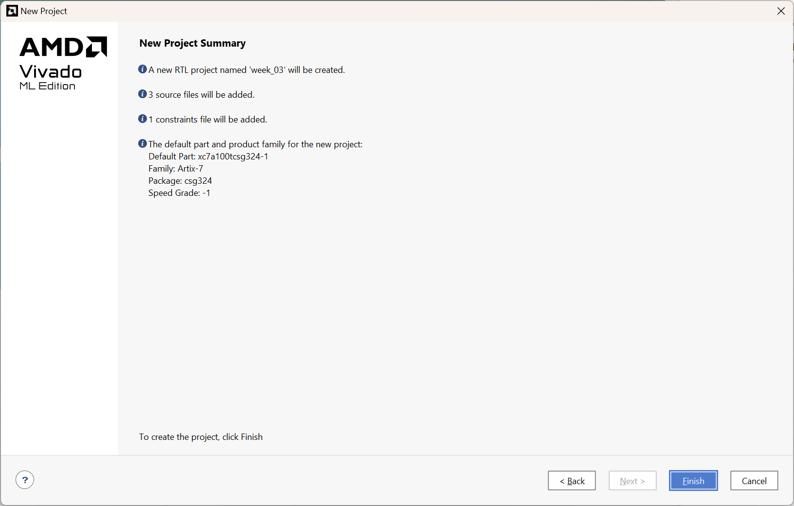

# Lab 1 : Getting familiar with FPGA tools

!!! info "Graded Lab Assignment" 

	This lab includes a graded lab assignment, worth **2 points**. Refer to [the page on grading](../../grading.md) for more information. 

## Introduction

In this lab, we will learn what an FPGA is, and use our FPGA board to learn how to design digital logic for, and program, an FPGA. We will use an FPGA for the final project for this course, where you will build a simple CPU, so it's important to be very comfortable using this powerful tool. 

You should have read the [Getting to know your Nexys 4](../../guides/nexys4.md) page before starting this lab. If you have not done so, please do so now. It is very important for you to know your equipment. 

### What is an FPGA?

We've thrown around the term FPGA a lot so far, and even mentioned that it stands for Field Programmable Gate Array. But what exactly does that mean? 

An FPGA is a device digital designers use to build and/or prototype digital logic circuits. As mind-blowing as it sounds, when we make a design on an FPGA, we actually change the internal structure of the chip to produce the logic that we want(1). It's kind of like a Lego set - we can connect different types of bricks (digital logic components) in different ways to build all sorts of structures (digital circuits). 
{.annotate}

1. This is a simplification of what really happens when we program an FPGA. In reality, FPGAs are like any other chip, with a fixed number of components which can't change. However, using a configurable network of interconnects, the connections between these components can be set to our liking, allowing us to build logic devices and circuits. To learn more about the weird and wonderful world of FPGAs, you can take [EE4218](https://nusmods.com/courses/EE4218/embedded-hardware-system-design) and learn more. 

Knowing this, the name Field Programmable Gate Array now makes more sense. "Field Programmable" refers to the fact that we can easily reprogram the chip without needing to take it off the board or doing anything too complicated. "Gate Array" refers to the fact that the chip is made of a large array of digital logic gates, which can be connected in (almost) any way we want. 

!!! note
	Strictly speaking, the term FPGA is used to refer to the chip on, say, our Nexys 4 board - the one in the center which says "Artix-7" on it. The Nexys 4 as a whole is an FPGA development board. Sometimes, we may refer to the whole board as an "FPGA" - this is technically incorrect. Similarly, an Arduino is a microcontroller development board, not a microcontroller; the Atmega 328P chip on the Arduino is the microcontroller. 
	
	In this website, we have made every effort to *not* be technically incorrect, but if you spot any places we've missed, do let us know!

### The FPGA design flow

In our lectures, we have already seen how different digital logic structures can be represented with a Hardware Description Language (HDL), such as SystemVerilog, our choice of HDL for this course. Now, we will explore how the HDL we write is turned into something we can upload to our FPGA board and use. 

Here is a very quick overview of the steps in creating a design for an FPGA:

1. **Write HDL code** <br>
This step is self explanatory. We must write HDL code to describe our design that we want to put on our FPGA. 

2. **Simulate HDL code** <br>
This is an extremely important step in the FPGA design flow. Unfortunately, it is also one that is super tempting to skip!  As a designer, it is extremely important for us to use the simulator to make sure our design is logically correct before we proceed to the next steps. If we decide to skip simulation and testing, we risk building and uploading a full design that produces the wrong output - with larger designs, this could be hours or days wasted! <br>

3. **Synthesis** <br>
Synthesis takes our HDL code and turns it into a "netlist" - that is, it converts it into a set of connections between the different components available on our FPGA board. 

4. **Implementation**<br>
Implementation takes our synthesised netlist and decides how the FPGA should be configured to implement that netlist. For example, it will choose the specific components to be used on the board (placement), and the specific wires that should be used to connect these components (routing). 

5. **Programming/Uploading** <br>
After running implementation, we need to generate a bitstream - this is a file we can upload to our FPGA board to program the FPGA and implement our design on it. Then, we upload the bitstream to our FPGA board, and voila: we have a working design on our FPGA!

!!! note
	In the steps above, the kind of simulation we cover is "behavioral simulation" - this only tells us if the logic we have designed is logically and mathematically correct. It is also possible to run post-synthesis and post-implmentation simulations. These are useful when we want to verify that our design is not only theoretically correct, but practically achievable on the FPGA board. For this course, we need only know about behavioral simulation. 

## Creating a new project in Vivado

You should have Vivado installed on your own computer, as explained in the [prerequisites](../../prerequisites.md). However, if you did not/could not complete those steps yet, you can use the lab PCs for now. However, we very strongly recommend installing Vivado on your own computer as soon as possible so you can practice at home, and work on your projects after class. 

Launch Vivado from the Start menu or desktop on Windows. If you are using Linux, the installer may or may not have made a shortcut for you. If it has, use that. If it hasn't, run Vivado from the command line: `source /tools/Xilinx/Vivado/2023.2/settings64.sh` followed by `vivado &`. 

When you launch Vivado, you should see a screen like this one:


/// caption

Vivado's startup screen, which appears when the software is launched

///

Click on "Create Project" under "Quick Start" to create a brand new project. A wizard will appear to guide you through the process. 


/// caption

The "Create a New Vivado Project" wizard

///

Click "Next". The following screen will ask you to give your project a name and location. Choose a descriptive name (eg. `week_03`) and save it somewhere you will remember. 

!!! tip 

	Where possible, do not save your project in a OneDrive folder on Windows. Vivado continuously updates some project files, and OneDrive will try to sync these all as they happen, which can cause various weird issues. Also avoid using a deeply nested folder, as long file paths can sometimes cause issues. 

	These precautions are useful not just for Vivado, but for many IDEs and development toolchains, especially for FPGA and microcontroller development boards. 

After selecting a project name and location, click "Next". Vivado will ask you to specify the type of project you want to create. 


/// caption

The "Project Type" screen

///

Here, select "RTL Project". Make sure "Do not specify sources at this time" and "Project is an extensible Vitis platform" are *unticked*. Then, click "Next". You will then be prompted to add source files to your project. 


/// caption

The "Add Sources" screen

///

Here, you will need to add two files that you have downloaded, and create a new one. Go ahead and click "Add Files", navigate to wherever you downloaded `Adder.sv` and `Adder_sim.sv`, and add those two files into the project. 

Under the "HDL Source For" column, change the setting for `Adder_sim.sv` to "Simulation only". 

!!! tip

	Having all your source files in the project directory is useful to keep them organized. So, we recommend keeping "Copy sources into project" ticked. It also means you can work on a copy of the files you downloaded, while not modifying the originals, so you can practice or experiment later without redownloading them. 

Next, click on "Create file". We need to create a new file called `Top.sv`. 


/// caption

The "Create Source File" prompt.

///

Select "SystemVerilog" as the file type, and name the file `Top`, as shown in the screenshot. Click "OK" to save your changes and then click "Next" to proceed. Now, you will be prompted to "Add Constraints". 


/// caption

The "Add Constraints" screen

///

Constraints files tell Vivado about the features of your FPGA board and how all of its peripherals like the LEDs and switches are connected to the FPGA chip. Therefore, every FPGA board has a different constraints file, and you must choose the correct one for your board. In our case, we are using a Nexys 4, so click "Add Files" and then add the file `Nexys-4-Master.xdc`. 

!!! warning
	If your FPGA box says "Nexys 4 DDR", then you **must** pick the `Nexys-4-DDR-Master.xdc` file. The two boards, while very similar, are not identical and require different constraints files. However, the rest of the steps will be the same regardless of which variant of the board you have with you. 

Once you have selected the constraints file, click "Next". The wizard will now prompt you to specify the default AMD part or board you are using. 


/// caption

The "Default Part" screen

///

Here, simply search for the part number `xc7a100tcsg324-1` and select that part, then click "Next". 

!!! tip
	You can choose to go into the "Boards" tab, and then find the Nexys 4 or Nexys 4 DDR to select. You may need to refresh the catalog by clicking the "Refresh" button. This is easier when you are using a board where you don't quite remember the alphabet soup part number of the FPGA. Feel free to use this method for future labs. 

You are now ready to create your project. You should see a screen with all the options you selected, so take a moment to confirm that they look right, then click "Finish". 



/// caption

The "New Project Summary" screen

///

After a few seconds, Vivado will create and open your new project for you. It will then prompt you to specify the inputs and outputs for the Top file. Continue to the next section to understand how to fill this section out.

## Creating a simple design

### Design specification

For our first lab, we will be building a very simple circuit on our FPGA. The end goal is to build a system where we use the switches to input two 8-bit numbers and see the sum of the numbers, plus the carry value, on the LEDs. 

For example, suppose you want to add 48 and 64. 48 in binary is `00110000` while 64 is `01000000`. Enter `00110000 01000000` on the switches, where `0` indicates a switch in the "down" position and `1` indicates a switch in the "up" position. The sum of 48 and 64 is 112, or `01110000` in binary. Then, the 8 LEDs on the right should show this value, with `0` meaning the LED isn't lit up, and `1` meaning it is. The image below shows this test case:

### Modules in HDL

Hardware Description Languages describe circuits in terms of "modules". Each module represents a block of hardware with inputs going in, and outputs coming out. An example of a module is the Adder module that we will explore today. The `Adder` has two 8-bit input buses for the two operands to be added, as well as an 8-bit output bus and a single carry wire for the result of the addition and the carry respectively.

Modules can be nested, that is, one module can contain another module. A module can contain one or many instances of one or many other modules. 

Usually, (good) FPGA designs will include a `Top` module, and one or more modules inside `Top`. This `Top` module is, as the name implies, at the top of the hierarchy and goes straight on the FPGA. Thus, the inputs and outputs of the `Top` module are the inputs and outputs of the FPGA chip itself - in our case, these are the peripherals on our board. So, knowing the requirements, we can deduce what the required inputs and outputs of the `Top` module are: the switches as our inputs and LEDs as our outputs. Enter these into the "Define Module" dialog box as shown below, then click "OK". 


/// caption

The "Define Module" prompt filled with the inputs and outputs required for the `Top` module

///

You should now see the main Vivado window, which looks something like this:


/// caption

The Project Manager view in Vivado, which should appear after you create a new project. 

///

After importing files into the project, Vivado may not have detected which module should be `Top` correctly. In my case, it is using the `Adder` module as the top module. You can see this in the "Sources" pane - the `Adder` module is bold and has a small icon next to it to indicate that this is the top module. 

To set `Top` as the top module, simply right-click it in the Sources pane, and click on Set as Top. Vivado may take a couple of seconds to update the pane to reflect this. 

To complete our design, we need to connect our `Adder` module in the `Top` module. To do so, double-click the Top module in the "Sources" pane, and add the following line of code after the last semicolon in the `module Top` declaration, and before the `endmodule` keyword:

```
Adder adder_1(
	.in_a (sw[15:8]),
	.in_b (sw[7:0]),
	.result (led[7:0]),
	.carry_out (led[8])
);
```

Let's break down what this code does:

1. `Adder` means we are trying to create an instance of the `Adder` module here. 

2. `adder_1` is the name we are giving this instance of this module.

3. `.in_a (sw[15:8])` indicates that we want to connect switches 15-8 (the leftmost 8 switches on the board) to the Input A of our adder. Similar reasoning applies to the rest of the connections. 

Finally, press Ctrl-S on your keyboard to save the file. After a few seconds, you will observe that the "Sources" pane reflects that an `Adder` module is instantiated within the `Top` module. 


/// caption

The "Sources" pane should reflect the `Adder` module being instantiated within the `Top` module like this

///

Congratulations! You have created a simple digital circuit design. 

### Elaborating the design

On the Flow Navigator pane on the left side of the window, you should see a group of options called "RTL ANALYSIS". Under this section, use the arrow to expand "Open Elaborated Design", then click on "Schematic". If there is a prompt about the current settings potentially slowing down elaboration, just click "OK" to continue with elaboration. After a few seconds, you should see the "Elaborated Design" view in your Vivado window, and the schematic of your design.

!!! question "Question 1 [0.5 points]"

	Include a screenshot of your RTL design of the Top module. Expand the Adder block to show the components inside it. If your elaborated design is too big to comfortably see in one screenshot, you may take multiple screenshots and include them all in your report. 

## Simulation in Vivado

!!! question "Question 2 [0.5 points]"

	Include a screenshot of your simulation waveform. You should show all four signals `in_a`, `in_b`, `result` and `carry`, over all four included test cases. 

!!! question "Question 3 [0.5 points]"

	Which bit is incorrect in your result? Which line of SystemVerilog code in `Adder.sv` corresponds to that bit? What is the correct line of code? 

## Generating and uploading the bitstream

!!! question "Question 4 [0.5 points]"

	Take the last four digits of your matriculation number. Split them into two 2-digit numbers. For example, if your matriculation number ends in 4864, your two numbers are 48 and 64. Convert these numbers to binary and use the switches to input them into the adder. Take a picture of your board and include it in your report, with the switch positions and LEDs clearly visible. 


