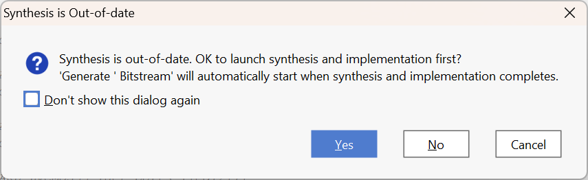

# Lab 2: Playing with the 7-segment display

!!! info "Graded Lab Assignment" 

	This lab includes a graded lab assignment, worth **4 points**. Refer to [the page on grading](../../grading.md) for more information. 

	This assignment includes **7 questions**, clearly demarcated throughout the manual. 

## Introduction

Welcome back to the second lab assignment for CS2100DE! We hope you enjoyed last week's lab. This week, we will hold your hand significantly less than last week; but you can always refer back to [Lab 1](../01/lab_01.md) for anything you need a refresher on. 

In this lab, we will learn to write combinational logic in Vivado, and use it to drive our seven-segment displays on the board. The end result will take inputs from the switches on the board and display characters on the seven-segment displays accordingly. We will also learn some more interesting simulation techniques. 

### Combinational logic

We learned about combinational logic in our lectures. Combinational logic is composed out of logic gates like NOT, AND, OR, XOR, and produces an output that is dependent purely on the input provided at that time. In other words, it has no memory elements, and cannot remember previous inputs or states. 

Here's a refresher on the basic logic gates, and how to produce them in SystemVerilog:

1. **NOT gate (inverter)**: produces the opposite of the value going in.
	``` systemverilog
	/* Truth Table:
	 * in  | out
	 * ----|----
	 * 0   |  1
	 * 1   |  0
	 */

	assign out = !in; 	// behavioral code
	not(out, in);		// structural code
	```

2. **Bitwise AND**: takes two inputs, and produces a `1` if both inputs are `1`, and `0` otherwise. 

	``` systemverilog
	/* Truth Table:
	 * in_a | in_b | out
	 * -----|------|-----
	 * 0    | 0    |  0
	 * 0    | 1    |  0
	 * 1    | 0    |  0
	 * 1    | 1    |  1
	 */

	assign out = in_a & in_b; 	// behavioral code
	and(out, in_a, in_b);		// structural code
	```

3. **Bitwise OR**: takes two inputs, and produces a `1` if at least one input is `1`, and `0` otherwise. 

	``` systemverilog
	/* Truth Table:
	 * in_a | in_b | out
	 * -----|------|-----
	 * 0    | 0    |  0
	 * 0    | 1    |  1
	 * 1    | 0    |  1
	 * 1    | 1    |  1
	 */

	assign out = in_a | in_b; 	// behavioral code
	or(out, in_a, in_b);		// structural code
	```

4. **Bitwise XOR**: takes two inputs, and produces a `1` if exactly one input is `1`, and `0` otherwise. 

	``` systemverilog
	/* Truth Table:
	 * in_a | in_b | out
	 * -----|------|-----
	 * 0    | 0    |  0
	 * 0    | 1    |  1
	 * 1    | 0    |  1
	 * 1    | 1    |  0
	 */

	assign out = in_a ^ in_b; 	// behavioral code
	xor(out, in_a, in_b);		// structural code
	```

!!! question "Question 1: Finally, They're Opening Up The Gates [0.2 points]"
    An AOI32 gate is a combination of AND and OR gates. Assuming its 5 inputs are A, B, C, D, and E, the output is (ABC+DE)'. Similarly, an OAI32 gate is a combination of OR and AND gates. Assuming its 5 inputs are A, B, C, D, and E, the output is ((A+B+C)(D+E))'. 
    
    If the **last digit of your student number** is *even*, write the **structural** SystemVerilog code for an AOI32 gate. If the last digit is *odd*, write the **structural** SystemVerilog code for an OAI32 gate. Behavioral SystemVerilog code will not be accepted.
    
    You do not need to write the code in Vivado, or create a project yet. Simply write down the code in your report. 

### How the seven-segment display works

The [Nexys 4 Reference Manual](https://digilent.com/reference/programmable-logic/nexys-4/reference-manual#seven-segment_display) does a very good job of explaining how the seven-segment displays are connected to the FPGA. 

We all know and love seven-segment displays. They are used in all sorts of electronics - microwaves, lifts, car dashboards, CD players. The Nexys 4 has two 4-digit seven-segment displays. Each of the seven (eight, if you count the decimal point) segments of the display are a separate LED and turning different segments on and off will display different numbers (and letters). 

LEDs have an anode (positive leg) and a cathode (negative leg). Current flows into the anode and out of the cathode. Similarly, the LEDs on the seven-segment display also each have an anode and a cathode. However, for each digit, we have one single anode shared by every segment. We still have a cathode for each segment, so we can control each segment individually.

Now, counterintuitively enough, while the anode is called... an anode, it actually needs to be driven low (i.e. set to `0`) to be enabled. This is what we call an "Active-low" enable. Thus, for a segment on the seven-segment displays to be lit, the anode corresponding to the digit, AND the cathode corresponding to the segment, must both be low, or `0`. 

??? note "This makes no sense. Is it opposite day?"
	The reason for this, as explained in the manual, is because the anodes each may need to carry a high current, so they are connected with transistors. A transistor will need 0 volts applied to its base to supply voltage to the anode, so that's why we must write `0` to the anode to enable it. 

Understanding the technical details above by just reading a wall of text might take a bit of brain power, which you probably don't have at 9:30 AM on a Friday. So, let's look at some examples which will hopefully make things clear. The diagram below depicts one digit of a seven-segment display.


/// caption

By <a href="//commons.wikimedia.org/w/index.php?title=User:Uln2003&amp;action=edit&amp;redlink=1" class="new" title="User:Uln2003 (page does not exist)">Uln2003</a> - <span class="int-own-work" lang="en">Own work</span>, <a href="http://creativecommons.org/publicdomain/zero/1.0/deed.en" title="Creative Commons Zero, Public Domain Dedication">CC0</a>, <a href="https://commons.wikimedia.org/w/index.php?curid=69807877">Link</a>

///

We have labelled each segment of the digit A through G. Let us say we want to display the digit `7` on the rightmost digit on the display. We would need segments A, B, C to be lit. To do this, the anode for digit 0 (the rightmost one) needs to be set to `0`, and all other anodes need to be set to `1`. Then, cathodes A, B, and C need to be `0`, while the others need to be set to `1`. 

In the constraints file that Digilent provides for the Nexys 4, the rightmost anode is numbered `0` and then the numbering continues to the left. Then, segment A maps to `0`, B to `1` and so on. So, `an[2]` maps to the third anode from the right. `seg[4]` maps to segment E. 

Sadly, while each segment within a digit has an independent cathode, that cathode is shared by the same segment on every digit on the display. For example, the cathode for segment A is shared by segment A on all eight digits. This means that it is impossible to display different characters on different digits at the same time.

??? note "Well, actually..."
	The key phrase in the last sentence above is the caveat "at the same time". As the astute among you may have guessed (and the fastidious among you may have read in the Reference Manual), it is possible to flash one digit at a time, in sequence, and doing so fast enough can make each digit appear to show a different character to the human eye. However, doing this will require sequential logic, which you will have just started to cover in this week's lecture. We'll come back to this next week. 

Let us look at some more examples:

1. Anode 0 is set to `0`, all other anodes are set to `1`. Cathodes A, B, D, E and G are set to `0`, C, F and DP are set to `1`. 


2. Anodes 1, 4, and 6 are set to `0`, all other anodes are set to `1`. Cathodes A, D, E, and F are set to `0`, all other cathodes are set to `1`. 


!!! question "Question 2: Light Up The Night [0.2 points]"
    Take the last digit of your **student number**, and write it down. Which cathodes of the seven-segment display should be set to `0` to display this digit?

## Driving the seven-segment display

### Design specification

As mentioned in the [introduction](#introduction), we will use the switches to control what gets displayed on the seven-segment displays. We will use switches 0 through 6 in the following fashion:

* Switches 0 through 3 will be used to enter a 4-bit binary number. As you will remember from Lecture 1, a 4-bit binary number can be interpreted as a single hexadecimal digit. This hexadecimal digit is what we will display on the 7-segment display.
* Switches 4 through 6 will be used to enter a 3-bit binary number. Thinking back again to Lecture 1, a 3-bit binary number can be interpreted as a decimal number between 0 and 7 (inclusive of both). In a happy coincidence, we have 8 digits on our seven-segment display, also numbered 0 through 7. The number entered with switches 4 through 6 will specify which digit of the seven-segment display(s) will be used to display the hex digit. 

!!! example

	1. If `0001011` is entered with switches 6 through 0, the seven-segment display should display `B` on the rightmost digit. 

	2. If `1010010` is entered with the switches, the seven-segment display should display `2` on the third digit from the left. 

!!! question "Question 3: Switch It Up [0.2 points]"
    Take the last 2 digits of your **NUSNET ID**, and convert it to an 8-bit binary number. Write down the binary number. Discard the most significant bit (MSB) of the binary number, leaving 7 bits. If these 7 bits are used as the input with the 7 switches, what should be displayed on the seven-segment display?
    
    Example: If your NUSNET ID is `12345678`, the last 2 digits are `78`. The 8-bit binary representation of `78` is `01001110`. Discarding the MSB, we get `1001110`. If these 7 bits are used as the input with the 7 switches, the seven-segment display should display `E` on the fourth digit from the left. 

### Deriving the logic needed

Before we get to writing RTL code, we should have some idea of what we want to do, in a more concrete manner than thoughts floating around in our heads. A good way to do this is to draw truth tables to specify exactly how our logic should behave. 

Below is a picture illustrating what each character 0 through F should look like on the display:


/// caption
The characters 0 through F being displayed
///

!!! question "Question 4: Nothing but the truth [0.4 points]"
	Write two truth tables for the seven-segment display decoder. The first should consider the anode output based on the input from switches 4 through 6. The second should consider the cathode output(s) based on the input from switches 0 through 3. 
	
	You may use a table in your word processor or draw one by hand and scan it. Handwriting must be very clear and legible. 

Now that we have a concrete specification that we can work with, it will be much easier to write our RTL code. 

### Writing the module(s)

Create a new project in Vivado for your Nexys 4 board. Refer back to [Lab 1](../01/lab_01.md) if you need to. In the project, create a `Top.sv` file (design source), a `SevenSegDecoder_sim.sv` file (simulation source), and import the `Nexys-4-Master.xdc` or `Nexys-4-DDR-Master.xdc` file (constraints).  

Download the `SevenSegDecoder.sv` file from the [GitHub repository](https://github.com/NUS-CS2100DE/labs/blob/main/lab_templates/week04/SevenSegDecoder.sv). Import it into your project. It is already filled with the inputs and outputs we expect you to use for this module. In summary, it takes the switches as input, and produces an output to the seven-segment displays. 

This module should implement the logic derived in [the section above](#deriving-the-logic-needed). So, we now fill out the module with the SystemVerilog code needed to implement the logic. 

!!! question "Question 5: Cracking the Code [1 point]"
	Inside `SevenSegDecoder.sv`, write the logic for the seven-segment display decoder in SystemVerilog. 
 	Paste your code for this module into your report. You may exclude the comment header that Vivado automatically generates. 

Cool! We now have our decoder written. No prizes for guessing what the next step is: it's simulation time. 

## Using loops in SystemVerilog simulation

Last week, we simulated the adder with a few (carefully selected) test cases, which just so happened to find the (carefully placed) bug in the HDL code. This week, we're not so lucky - who knows what bugs we've introduced, and where! It's probably a good idea to test all the possibilities, rather than end up like [that one Intel Pentium](https://en.wikipedia.org/wiki/Pentium_FDIV_bug). 

While it is impossible (okay, *impractical*) to test every possible case for floating point operations, it's certainly very possible to simulate 16 cases for switches 0 through 3, and 8 cases for switches 4 through 6. Still, writing 24 test cases by hand doesn't sound fun. Thankfully, we don't have to - this is where loops in SystemVerilog come in. 

You should be familiar with loops in at least one programming language - C/C++ from Arduino, Python from CS1010E, or another language you picked up yourself (Java? Rust? COBOL?). SystemVerilog has loops too, and they're a very useful tool in simulations, where you might want to repeatedly input different test cases. 

!!! tip
	You can, in fact, use loops in SystemVerilog RTL code. However, they are **NOT** used to repeat computations or actions - instead, they are used strictly to avoid writing repeated RTL code. Do **NOT** confuse yourself with this, and do **NOT** use loops in RTL code if you do not understand what they do. 

	We have included an example of a loop in RTL code in `SevenSegDecoder.sv` for you to understand how loops should be used: 

	```systemverilog linenums="31"
	genvar i;
    for(i = 0; i < 7; i++) begin
        assign an[i] = (sw[6:4] == i) ? 0 : 1;
    end
	```

Let's look back at `Adder_sim.sv` from last week, and consider how we could use a loop to go through many possible inputs. 

=== "Without using loops"
	``` systemverilog
	initial begin
		in_a = 8'b0;
		in_b = 8'b0;
		#10;
		in_a = 8'b1010;
		in_b = 8'b1010;
		#10;
		in_a = 8'b11111111;
		in_b = 8'b11111111;
		#10;
	end
	```
=== "Using loops"
	``` systemverilog
	initial begin
		for(int i = 0; i < 256; i++) begin
			in_a = i;
			for(int j = 0; j < 256; j++) begin
				in_b = j;
				#10;
			end
		end
	end
	```

Now, let's try and practice making loops by ourselves, by writing a loop in our simulation that will test every possible combination of switches. 

For today, it will suffice to test the digit input (i.e. switches 0 through 3, determining what digit is to be displayed) separately from the selection input (i.e. switches 4 through 6, determining which digit of the seven-segment displays is used to display the digit). 

!!! question "Question 6: Froot Loops [1 points]"
	Show your HDL simulation code, which should loop through every possible input from the switches. 

Needless to say, we should run the simulation and make sure that there are no bugs in the code we have written. If there are, we should fix them, and run the simulation again - and repeat the problem until our code works flawlessly. 

## The fruits of our labour

Finally, it is time for us to see the results of our hard work. This time, no more training wheels - only the basic steps are given here!

1. First, we need to put an instance of our `SevenSegDecoder` module inside our `Top` module, and make the appropriate connections. 

2. Next, we need to set up the constraints file. Which peripherals are we using? How should we modify the constraints file to use these?

3. Finally, run synthesis, implementation and generate the bitstream. 

!!! tip
	If you want to save a little bit of time and brain power, you can just click "Generate Bitstream", and if you haven't already run synthesis and implementation, Vivado will prompt you for permission to automatically do so. 

	

!!! question "Question 7: Just like the simulations [1 point]"
	Tell your nearest Graduate Assistant (GA) you are ready to test your design. They will give you five test cases to try. Try all of them on your board, and show one picture for each test case in your report. 

## Concluding remarks

Well done! We've finished the second lab assignment. Remember to follow the instructions on the [Grading Page](../../grading.md#lab-assignments). 

!!! success "What we should know"
	* How the seven-segment displays on the Nexys 4 board work. 
	* How to write truth tables for logic. 
	* How to write RTL code in SystemVerilog from scratch.
	* How to use loops in HDL simulation code. 

## Optional practice problem

Using the Adder module from last week, modify the system to add up the numbers input by switches 0 through 3, and switches 8 through 11. Display the least significant hex digit on the seven-segment display, and the most significant hex digit on the LEDs as a binary number. You should still be able to use switches 4 through 6 to select the digit of the seven-segment displays used. 
