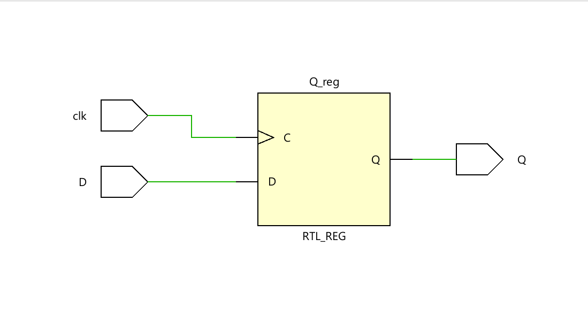
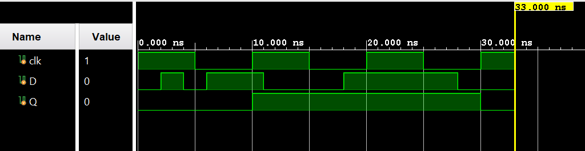
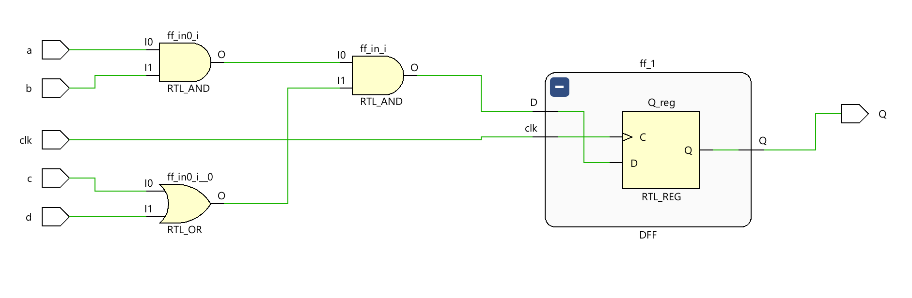
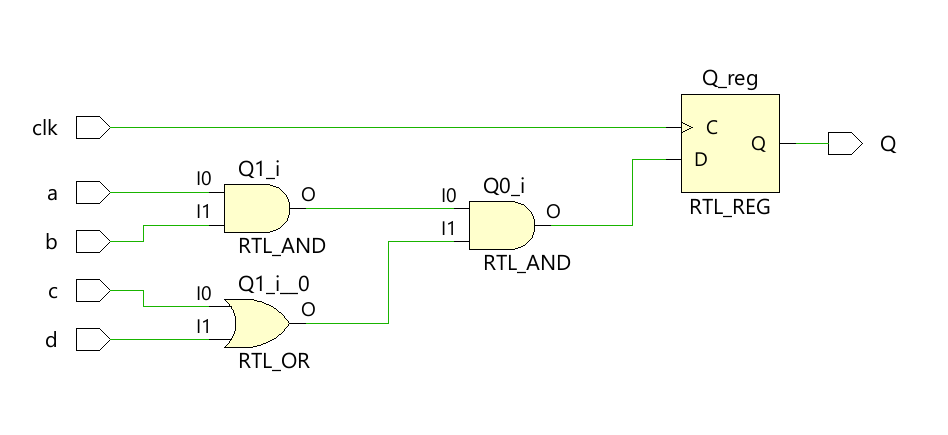
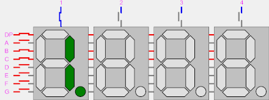

# Lab 3: Creating more complex sequential logic

!!! info "Graded Lab Assignment"

	This lab includes a graded lab assignment, worth **6 points**. Refer to [the page on grading](../../grading.md) for more information. 

	Today's lab will be a bit different. Activity 1 (worth **3 points**) is to be completed in class, with the report submitted as usual. Activity 2 (worth **3 points**) is a take-home assignment, which you must demonstrate to the teaching team in Week 6. 

## Introduction

Hello there! Welcome back once again to CS2100DE. After the last couple of weeks, we should be reasonably comfortable with the basics of digital design, and we should also be quite at home using Vivado. Of course, the previous manuals are still available to look at for reference. 

Today, we will learn all about sequential logic. We will start by developing a simple counter that can count up or down, as we prefer. Then, we will display this counter on the seven-segment displays - this time, every digit will be able to show a different character! We will explore some more new simulation techniques too. 

As we did last week, we will hold your hand even less this week; but we believe in you :) Feel free to approach the GAs or TA in charge with any questions or concerns you have. 

### Clocks

In digital design, a clock is a signal that is used to time a digital circuit. It is a square (ish) wave that goes up and down at a fixed time interval. Clock signals are generated by oscillators, e.g. a piezoelectric crystal like quartz.


/// caption

From [Wikipedia](https://en.wikipedia.org/wiki/Crystal_oscillator): "A miniature 16 MHz quartz crystal enclosed in a hermetically sealed HC-49/S package, used as the resonator in a crystal oscillator."

By <a rel="nofollow" class="external text" href="https://www.flickr.com/people/33504192@N00">oomlout</a> - <a rel="nofollow" class="external free" href="https://www.flickr.com/photos/snazzyguy/4150705616/">https://www.flickr.com/photos/snazzyguy/4150705616/</a>, <a href="https://creativecommons.org/licenses/by-sa/2.0" title="Creative Commons Attribution-Share Alike 2.0">CC BY-SA 2.0</a>, <a href="https://commons.wikimedia.org/w/index.php?curid=23310595">Link</a>

///

Most digital circuits require a clock signal, and this is what determines how fast it runs. So, when we go to buy a laptop, and see one that says it runs at e.g. 3.5 GHz, that means the clock signal runs at 3.5 GHz, or 3.5 billion cycles per second. (Yes, that's really fast.) Your phones, laptops, Arduino, etc. all use clock signals to time themselves. And yes, our FPGA has a clock built in, which runs at 100 MHz - that is, it completes a full period (on and then off) 100 million times a second (or every 10 nanoseconds). 

When the clock signal goes from `0` to `1`, we call that a "positive edge". When the clock signal goes from `1` to `0`, we call that a "negative edge". 

### Registers

A register is a memory element that stores the value of a bit. For the purposes of FPGA designs (for Xilinx FPGAs, anyway), a register is a D-Flip Flop (remember those from last week?). At every positive clock edge, whatever is on the input `D` gets transmitted to the output `Q`, and doesn't change until the next positive clock edge. So, we can see how the register has "memory" - while a combinational circuit will change as soon as any of the inputs change, a register will retain the same output until it receives a clock signal. 

To make this a bit more concrete, here is some SystemVerilog code to create a D flip flop:

```systemverilog linenums="1"
	module DFF (
		input clk,
		input D,
		output reg Q
	)
		always @(posedge clk) begin
			Q <= D;
		end
	endmodule
```

Let's dive a bit deeper and explore what each line of code does. 

First, of course, we must define the inputs and outputs to the module. As we remember from the lectures, a D flip flop has an input for the clock, an input D and an output Q. 

```systemverilog linenums="1"
	module DFF (
		input clk,
		input D,
		output reg Q
	)
```

Note that we need to declare `Q` as an `output reg` instead of simply an `output`. Vivado doesn't do this for you automatically when you create the module and define its inputs and outputs, so you must add the keyword `reg` in by yourself. Happily enough, Vivado will indeed yell at you right in the text editor if you forget to do it, saying "procedural assignment to a non-register Q is not permitted" - one of the more descriptive and precise errors you can get :3

Next, the sequential logic signature dish: 

```systemverilog linenums="6"
		always @(posedge clk) begin
			// ...
		end
```

The keyword `always` is as the name implies; it means that any behaviour defined inside this block will be repeated till the end of time (or until you turn off/reprogram the FPGA, whichever comes first). This is the same behaviour as combinational logic - once you define a combinational logic circuit, it performs the same function till the end of time. 

The `@(...)` syntax is used to define the "sensitivity list" - that is, it defines which input(s) should be used as a cue for the logic to take effect. In this case, we say `always @(posedge clk)`, meaning that our logic should take effect at every positive edge of the clock, or, whenever the clock goes from `0` to `1`. 

Finally, we must define the logic that will be executed at every clock edge, so:

```systemverilog linenums="7"
			Q <= D;
```

This simply states that we will assign the value seen at the input D, to the output Q. 

If, instead, we had simply written:

```systemverilog
	module DFF (
		input D,
		output Q
	)
		assign Q = D;
	endmodule
```

This would have been combinational logic. Remember that when we defined combinational logic, we said that the output of combinational logic depends on the inputs *at that moment*. Notice the difference in this module: `Q` will not change as soon as `D` changes. Instead, it will change when the clock has a positive edge. Thus, sequential logic has "memory" - it can remember what the previous state was until there is a clock edge. 

Elaborating this code produces a schematic that looks like this:



/// caption

The schematic of a D flip flop elaborated in Vivado

///

We can see that it produces a flip flop just like we saw in the lecture. 

We can simulate the D flip flop and observe its operation:



/// caption

The result of simulating this DFF module

///

In this simulation, we start with `D` and `Q` at `0` and `clk` at `1`. 

1. Between 0 and 10 nanoseconds, we can see that no matter how much `D` changes, as long as `clk` remains `0`, the change is not propagated to `Q`. 

2. Then, at 10 nanoseconds, when `clk` goes from `0` to `1`, since `D` is `1` at that moment, `Q` will become `1`. 

3. At 11 nanoseconds we observe that even as `clk` is `1`, changes in `D` are still not propagated to `Q` - remember, the changes only propagate when `clk` has a positive edge, not when it is `1` or `0`. 

4. At 15 nanoseconds, when `clk` goes from `1` to `0`, we see that the changes are still not propagated to `Q` - this is a negative edge.

5. At 20 nanoseconds, when `clk` goes from `0` to `1`, we see that `D` is again `1`, so `Q` remains as `1` and doesn't change. 

6. Finally, at 30 nanoseconds, when `clk` goes from `0` to `1`, we see that `D` is `0` and therefore `Q` becomes `0` again. 

7. The code we used for simulation here can be found [here](https://github.com/NUS-CS2100DE/labs/tree/2f9e4f3bf2d8cbd39fa70472e234890a963f4d8c/lab_templates/week05), but don't worry if you don't understand it. We will go through how to simulate synchronous hardware soon. 

### Sequential logic

Sequential logic, or sequential circuits, are essentially a block of combinational logic that is placed behind a register (in our case, a D Flip Flop). 

Consider the following code:

```systemverilog
module LogicWithDFF(
    input a,
    input b,
    input c,
    input d,
    input clk,
    output Q
    );
    
    logic ff_in;
    DFF ff_1(clk, ff_in, Q);
    
    assign ff_in = a & b & (c | d); 
endmodule
```

This code creates a combinational block that performs the logic function a AND b AND (c OR d). Then, it connects the output of the combinational logic to the input of the D Flip Flop we just created. The schematic produced looks like this:



/// caption
A block of combinational logic behind a D Flip Flop, giving us a sequential circuit
///

Here, instead of the input to the register being just a single wire, we have some complex logic. It will behave just like the register, in that the output `Q` will not update until a positive clock edge. 

We do not need to explicitly define registers when writing SystemVerilog code. Instead, we can infer them as below:

```systemverilog
module DFFWithLogic(
    input clk,
    input a,
    input b,
    input c,
    input d,
    output reg Q
    );
    
    always @(posedge clk) begin
        Q <= a & b & (c | d);
    end
endmodule
```

The schematic for this circuit looks almost identical, with the exception that the flip flop is not inside a module:



/// caption
The same circuit as above, implemented in a simpler format
///

And on that note, we are ready to tackle our first lab activity, where we will create a counter that can count up. Sounds simple, but you'll see you can learn a lot from it...

## Activity 1: Creating a simple counter

!!! info 
	This activity should be done in class. All the questions within this activity should be answered in the report as usual.

In this activity, we will create a counter that can count up and down. We will use HDL simulation to verify the functionality, before we finally display the output on the seven-segment displays. 

Create a new project in Vivado. For now, just give it a `Top` module and specify `clk` as an input. We'll figure out the rest later. 

### Design Specification

For this activity, we will design an 8-bit Counter module. 

The module inputs should be:

* `clk` (clock signal)
* `rst` (reset counter)
* `up_down` (1 bit to determine counting direction)

The module output should be:

* An 8-bit value `count`. The module should initially output the value `8'b0` on `count`. 

If `up_down` is `0`, the module should count up from `0`, i.e. `1`, `2`, etc. If `up_down` is `1`, the module should count down, eg. `0`, `255`, `254`, etc.

If `up_down` changes while counting, it should continue counting from the last number it reached. E.g. [`up_down == 0`] `0`, `1`, `2`, [`up_down == 1`] `1`, `0`, `255`, `254`, [`up_down == 0`] `255`, `0`...

Counting should be done on the positive edge of the clock. That is, the counter value should increment (or decrement) by 1 every time the clock goes from `0` to `1`. 

`rst` is an active-low reset signal. If (and only if) `rst` is 0 at a positive clock edge, the counter should reset to `0`. 

### Designing our counter

The design specification is a lot to take in, but it's not as bad as it looks. Let's break our work down into steps. 

1. Create a new module called `Counter`. Give it the inputs and outputs we specified above. 

2. We know that the goal of the counter is to increment the value of `count`. So, write a line of code that increases the value of `count` by 1. Hint: assign `count` to the sum of `count` and 1. 

3. The next thing we know is that depending on `up_down`, the counter should count up or down. Use the ternary operator syntax (`assign value = (condition) ? value_if_true ! value_if_false`) to implement this.

4. Then, add another condition to reset the counter to 0 when the reset signal is low.

5. Finally, we add the special sauce that makes our code sequential. Encapsulate the code you have written so far in an `always` block, as illustrated below:

	```SystemVerilog
	always @(posedge clk) begin
		// your code from step 3 here
	end
	```

6. At this point, Vivado will probably be complaining, saying "Procedural assignment to a non-register count is not permitted, left-hand side should be reg/integer/time/genvar." There are a couple of changes we need to make. 
	
	1. First, we must change the line `output [7:0] count` to `output reg [7:0] count`. At this point, Vivado will not complain anymore, but we must make some more changes. 

	2. Next, we must remove the keyword `assign` from our code.

	3. Finally, we must change the `=` sign (for a blocking assignment) to `<=` (for a non-blocking assignment). 

!!! warning

	When writing sequential code, there are two types of assignments: non-blocking assignment, denoted with `<=`, and blocking assignment, denoted simply with `=`. These two are not generally equivalent, and **should not be used interchangeably**. 

	The difference is that blocking assignments are considered to be ordered - that is, we assume we define the order in which connections are defined matters. 
	
	**We recommend avoiding the blocking assignment `=` completely for sequential code**. It should only be used if we're extremely sure we know what we're doing, and even then, in very rare circumstances. Always using the non-blocking assignment `<=` will not be problematic, and for this course, you will definitely never need to use `=`. There will always be a better way to do it with a `<=`. 

!!! question "Question 1: Tick, tock [1 point]"
	
	Please show all of the code inside your Counter module. You need not include the comments that Vivado automatically generates.

Now, you have a counter module, and are ready to proceed further. You should have spent no more than 60 minutes for this task. 

### Even more simulation techniques

We have a counter, but no way to know if it's remotely correct. So guess what time it is?

Last week, we used `for` loops to simulate 16 test cases in one shot. It saved us a bunch of time from having to write test cases by hand. However, just running simulation is barely half the story; we need to verify that the results are correct. Doing that for 16 test cases is one thing, but for around 4000 possible combinations (by my napkin maths) it would drive you to insanity. So, let's automate some more checking so we don't need to waste our time debugging. 

Create a new simulation source called `Counter_sim`. You should know how to do this, if not, refer to Lab 1. 

!!! tip

	In Vivado, if we create a module with no inputs or outputs, it creates a blank file without the template to get you started. To work around this, we can add a dummy input `x` to your simulation module and simply remove the `input x` line in the file later. 

We will not provide exact code to type in, but the following steps should be enough to write the code. 

1. Create `logic` instances for all the inputs and outputs to `Counter`. Remember to choose the widths appropriately.

2. Instantiate the `Counter` module. 

3. Create a new `Integer` variable call `correct_count`. Initialize it to 0. 

3. Create an `initial` block to run our simulation code. 

	1. Start by setting `clk`, `up_down` and `rst` to `0`. 
	2. Wait for one nanosecond, then set `rst` to  `1`. 
	3. Create a `for` loop. It should run for 20 iterations. In the loop:
		1. Compare `count` to `correct_count`. If they do not match, use the function `$error()` to display an error message, and the command `$stop` to stop the simulation immediately. Hint: you can use `if ... else` statements in SystemVerilog simulations.
		2. Increment the `correct_count` variable.
		3. Wait for 10 nanoseconds for the next clock edge. 
	4. Set `up_down` to `1`. 
	5. Create a new `for` loop. It should be identical to the previous loop, with one exception: you must decrement `correct_count` instead. 
	6. Finish the `initial` block with a `$finish` command. This will terminate the simulation, and your waveform will be just the right length. 

4. Create an `always` block to make the clock tick at 100 MHz. That is, it should go high for 5 nanoseconds, then go low for 5 nanoseconds. 

!!! question "Question 2: In the Matrix [1 point]"

	Please show the code for your simulation and the simulation waveform, including the signals `clk`, `up_down`, `rst` and `count`, as well as `correct_count`. 

	Needless to say, your simulation should run all the test cases and pass them. 

Congratulations! You have built a working counter. The bulk of the work should be done by now. You should have spent no longer than 90 minutes on this task, or 150 minutes in total. 

### Slowing down our counter

Our counter can now count up and down correctly. However, there's a problem: it's too fast! 

Like we mentioned above, the FPGA's built-in clock runs at 100 MHz, or a hundred million clock edges per second. We can count up to 255 in just over 2 microseconds - that's way too fast for us to appreciate. Let's slow down the counter a bit so we can see it. 

We will create a second counter, that increments at every clock edge. It will be reset to zero after a certain number of counts - say, 10 million. Then, we will increment `count` every time this new counter is equal to zero. In this example, every 10 million clock edges, the new counter will be reset to zero. This means that `count` will be incremented every 25 million clock edges, or at 4 Hz. 

You may want to try implementing the above by yourself. If you need a hint, see the section below:

??? note "Detailed steps - do not reveal if you want to challenge yourself"

	1. First, let us do some maths. Our FPGA's clock runs at 100 MHz. Suppose we want the counter to count up at 4 Hz. How many clock edges do we need between two counts? Call this value `N_COUNTS`. 

	2. What is the minimum number of bits we need to be able to count up to this number? Call the number of bits `N_BITS`. 

	3. Create a new `logic` value called `clk_cnt`. It should be a bus of `N_BITS` values. 

	4. Like we did in the first part, increment `clk_cnt` by one every clock edge. 

	5. Using the ternary (`?` and `:` syntax) operator, add a condition so that when `clk_cnt` is equal to `N_COUNTS`, it is reset to 0, and otherwise, it is incremented. 

	6. Finally, in the line that increments `count`, add the condition that `count` should only be incremented 

!!! question "Question 3: Reduce Speed Now [1 point]"

	Please show the RTL schematic and the finished code of your Counter module, after it has been slowed down. 

Well done! You have finished the in-class portion of this week's lab. Please submit your report now. The remainder of the activities in this manual are take-home. 

## Activity 2: Displaying the counter on the seven-segment display

!!! info

	This activity is take-home. There is no submission or report required for this activity. However, you must demonstrate that your design works as specified, at the beginning of lab next week. 

We've made and verified a counter that can count up and down. But it's no fun having something imaginary inside a simulation (insert *Matrix* references). Let's display the output of the counter on the seven-segment displays. 

### Design specification

The final product for this activity will include three counters, that count up and/or down independently of each other. 

Counter 0's output will be displayed on displays 7 and 6 (the first two from the left). Counter 1's output will be displayed on displays 4 and 3 (the two in the middle). Counter 2's output will be displayed on displays 1 and 0 (the first two from the right). 

Displays 2 and 5 should be blank. 

All counters' values will be displayed in hex format. We will use the SevenSegDecoder module from last week to save us some time. 

The `up_down` signal for counter 0 will be controlled by switch 2. The `up_down` signal for counter 1 will be controlled by switch 1. The `up_down` signal for counter 2 will be controlled by switch 0. 

The `rst` signal for counter 0 will be controlled by the left push button. The `rst` signal for counter 1 will be controlled by the center push button. The `rst` signal for counter 2 will be controlled by the right push button. 

Below is a video of the final product you should have:


### Taking advantage of persistence of vision

Last week, we said that because of the way the seven-segment displays are wired, we can only show one unique character on the displays, at any given time. Those that read the accompanying note may remember the caveat - "at any given time". However, we can play some tricks on our eyes. 

By showing characters on one display at a time, but changing the display used very fast, we can create the illusion of different displays showing different characters. This is due to persistence of vision: when we see something with our eyes, they retain that image for a few fractions of a second, and merge it with what they see subsequently. When we change the display used very fast, our eyes cannot react fast enough to one display turning off, and it gives the illusion of all the displays being lit simultaneously. 

The following animation shows, first in slow motion, then slowly speeding up, how this should look. 



/// caption

By Laserlicht, <a href="https://creativecommons.org/licenses/by-sa/4.0" title="Creative Commons Attribution-Share Alike 4.0">CC BY-SA 4.0</a>, <a href="https://commons.wikimedia.org/w/index.php?curid=115556518">Link</a>

///

Once again, the [Nexys 4 Reference Manual](https://digilent.com/reference/programmable-logic/nexys-4/reference-manual#seven-segment_display) is a useful resource for an alternative explanation. 

### Putting everything together

Finally, we must put what we've learned together. Since you have a week to finish this activity, the instruction will be minimal. 

Following, in no particular order, are some tips for creating your final design. 

* Use three `Counter` modules and one `SevenSegDecoder` module from last week in this design. 

* Use a 3-bit counter to decide which anode to light up. You can design this counter right inside `Top`, but it'll be better if you create a new module, say `SlowCounter`. It will be similar to the counter we already designed in the lab. Use the same 3-bit counter to decide what to display on the segments. 

* Note that displays `2` and `5` will always be blank, so we should skip these. Instead, when our counter is at `2` or `5`, we can simply keep displaying the previous digit. Or, we can design the counter to skip `2` and `5`. Both methods will be accepted. 

* We recommend a refresh rate of >500 Hz to make the displays look seamless to the naked eye. Rates too high will cause problems. Try to change the displays at anywhere between 500 to 2000 Hz. 

* The pushbuttons we need are labelled `btnC`, `btnL` and `btnR` in the constraints. Remember to add them, and any other inputs and outputs used, to the inputs and outputs of the `Top` module. 

!!! question "Question 4: One, two, three, jump [3 points]"
	
	Demonstrate the finished product to your nearest member of the teaching team (GA or TA/instructor/lecturer). We will check the functionality and make sure it is as specified. No further action for this part is needed on your end. The points you score will be added to your score for this report later. [1 point]

	You will be asked two questions regarding your understanding of the implemented solution. You may refer to any materials you need to answer these questions. [2 points; each question worth 1 point]

	To be very clear, hardware implementation is **required**. The final product should be running on your Nexys 4 board by next week. 

	This task is due next week, at the start of the lab. Instructions for the demo will be made available on Canvas. 

You should not need more than an afternoon or so to implement this. If you require assistance, post your questions on the [Discussions page](https://github.com/NUS-CS2100DE/labs/discussions). Remember to not send the teaching team emails with technical questions. 

## Concluding Remarks

And that concludes our third lab assignment! Remember to follow the instructions on the [Grading Page](../../grading.md#lab-assignments) and upload your assignment on time. 

!!! success "What we should know"
	* How to use the clock built into our FPGA. 
	* How to design, write and use sequential logic in Vivado with SystemVerilog. 
	* How to play tricks on our eyes with the seven-segment displays.
	* How to reduce our own workload by getting our simulation to automatically verify our design. 

Next week, we will be taking a break from Vivado and digital design, to have some fun writing RISC-V assembly code. 
