# Lab 4: Introduction to RISC-V Assembly

!!! info "Take-Home Assignment"

	This manual includes a take-home assignment, worth **8 points**. For each question, you will produce a separate `.asm` file. Zip up all the files into one `.zip` archive and upload it to Canvas. 

## Introduction

Welcome back to CS2100DE! This week, we are going to give Vivado a rest, and take up something new and different: RISC-V assembly language programming. Now that we have the background knowledge of logic and design that we need, we can talk about the meat and potatoes of this course: computer organization and architecture. 

### What is an ISA? 

We talked about the definition of an ISA in the lectures - it's a layer of abstraction between the programs we write and the hardware that they run on. 

CPUs are complicated devices, and having to think about how to use every single component inside them individually would be a nightmare. Instead, each CPU has an associated Instruction Set Architecture, or ISA. It defines how instruction words are to be interpreted by the CPU, and what each instruction should do. 

Importantly, an ISA does *not* define or describe the underlying hardware that performs the instructions. That is the microarchitecture. The ISA only defines the instructions and what the results should be. 

For example, the device you're reading this on is probably using either the AMD64 (or x86_64) ISA, or the ARMv8-A ISA. The former is used by Intel and AMD CPUs like you might be using on your laptop or desktop, while the latter is used by Apple, Qualcomm and others to build system-on-chips like the M-series (seen in newer MacBooks) or the Snapdragon series (seen in many phones and some new laptops). A program written for an Intel Core i7-12700 will run on an AMD Ryzen 9 3950X, because they share the base ISA of AMD64. 

??? note "A note on ISA extensions"
	While CPUs using the same ISA are mostly cross compatible with each other, the story becomes slightly complicated when considering ISA extensions. As the name implies, an ISA extension is an optional, additional set of instructions that can be implemented on a CPU if the manufacturer desired. Different CPUs with the same base ISA can implement different ISA extensions, which can make cross-compatibility less straightforward. 
	
	A contemporary example is the [AVX-512 extension for x86_64](https://www.intel.com/content/www/us/en/products/docs/accelerator-engines/what-is-intel-avx-512.html). Programs compiled to use the AVX-512 extension can use extra instructions, which are not available on CPUs that do not implement this extension and therefore won't run on such CPUs. [The Stockfish chess engine](https://stockfishchess.org/download/windows/), for example, has different versions depending on which ISA extensions your particular CPU implements. 

	Strictly speaking, AMD64/x86_64 is also an ISA extension to x86. Code written for AMD64 ("64-bit programs") will not run on x86 CPUs. However, code written for x86 will run on CPUs with the AMD64 extension.

### What's RISC-V? 

RISC-V is a new, modern CPU architecture designed from the ground up for today's needs. Existing ISAs such as x86_64 and ARM are proprietary, and are prohibitively expensive and tedious to use in your own products. If, for example, we want to build a new chip with an ARM CPU, we would need to pay licensing fees and royalties to ARM. This makes the process of designing a new chip prohibitive for companies or organizations without huge pockets, such as us :)

RISC-V was developed by UC Berkeley, and released under the [BSD License](https://en.wikipedia.org/wiki/BSD_licenses), making it [free (as in "free speech")](https://www.gnu.org/philosophy/free-sw.html). This means that a small startup, or a hobbyist, or a student, can use the RISC-V ISA  in any way they please, including modifying and redistributing it. Thus, we can use the RISC-V ISA to develop our own CPU on our Nexys 4: which, believe it or not, is what we're going to achieve at the end of this course. 

??? note "RISC-V Extensions"
	[RISC-V also has a few extensions available](https://en.wikichip.org/wiki/risc-v/standard_extensions), such as Multiply, Floating-Point, Atomic and Vector. In this course, we will implement the base integer RISC-V ISA, or RV32I for short.

As the name implies, RISC-V is a Reduced Instruction Set Computing (RISC) architecture. Today, the lines between RISC and CISC (Complex Instruction Set Architecture) are blurred, but the biggest differentiator is that CISC architectures typically have fewer general-purpose registers, and allow instructions to perform logical operations on values in memory. 

### Memory

We just talked about CISC architectures being able to perform operations on values in memory. But what exactly is the "memory"?

When we talk about memory in this course, we typically mean the system memory, or main memory. This is usually the RAM (and ROM) on a computer. Memory is used to store programs and variables. 

We may have many bytes (in modern computers, probably billions of bytes) of memory. Each byte of memory has an address, which is simply a number. In 32-bit architectures, the addresses are 32 bit numbers. Thus, we can address a maximum of 4 gibibytes of memory uniquely. You can think of the memory as a long list of numbers, and the indices of each number is the address

??? note "When there is a will, there is a way"
	There are clever ways that people used to access more than 4 gibibytes of memory on a 32-bit system. One popular one is [Physical Address Extension](https://en.wikipedia.org/wiki/Physical_Address_Extension). And, since our memory is not byte or half-word addressable anyway, and the two least significant bits of the address are ignored, we could potentially have 4 gibiwords of memory, or 16 gibibytes, by using all 32 bits and simply assuming there are two additional zeroes at the end of every address. 

By the way, "gibibyte" is not a typo: a "gigabyte" is a billion bytes, or 1\*10^9 bytes. A gibibyte is 1\*2^20 bytes. Gigabyte is shortened to GB, while Gibibyte is shortened to GiB. Most people always use Gigabyte, and in fact macOS uses "Gigabyte" to refer to gibibytes. But, that's technically incorrect. 

### Registers

In last week's lab, we talked about how registers are implemented with D Flip Flops on our Xilinx FPGAs. However, at an architecture level, a "register" isn't necessarily a flip-flop, it is just a memory element that can be accessed directly from the CPU. This is in contrast to system memory, where the CPU must use addresses to access areas of memory. The RISC-V ISA specifies 32 registers that programs can use, numbered `x0` through `x31`. 

`x0` is a special register as it is read-only, and always contains the value `0`. We discussed in the lectures that this allows us to perform move operations without a separate instruction. 

`x1` through `x31` can be used to store any 32-bit number. Remember that "data types" are merely a software construct, which do not exist at the architecture level, and certainly not at the hardware level. The instructions must be chosen correctly depending on what we've stored in the registers. At the end of the day, a number is a number, at the architecture level. 

All the registers have a name that describes the function they should be used for. The functions are described in the [RISC-V Application Binary Interface (ABI) specification](https://lists.riscv.org/g/tech-psabi/attachment/61/0/riscv-abi.pdf). The ABI describes how an operating system, such as Linux, running on a RISC-V CPU should use the registers. Here is a table showing what each register is used for:

??? note "Table of RISC-V registers (uncollapse this box)"
	| `Register Number` | `Register Name` | Function                                   	|
	|-------------------|-----------------|---------------------------------------------|
	| `x0`              | `zero`          | Always zero                                	|
	| `x1`              | `ra`            | Return address                             	|
	| `x2`              | `sp`            | Stack pointer                              	|
	| `x3`              | `gp`            | Global pointer                             	|
	| `x4`              | `tp`            | Thread pointer                             	|
	| `x5`              | `t0`            | Temporary register 0                       	|
	| `x6`              | `t1`            | Temporary register 1                       	|
	| `x7`              | `t2`            | Temporary register 2                       	|
	| `x8`              | `s0/fp`         | Saved register 0 / Frame pointer           	|
	| `x9`              | `s1`            | Saved register 1                           	|
	| `x10`             | `a0`            | Function argument 0 / Return value         	|
	| `x11`             | `a1`            | Function argument 1 / Return value         	|
	| `x12`             | `a2`            | Function argument 2                       	|
	| `x13`             | `a3`            | Function argument 3                       	|
	| `x14`             | `a4`            | Function argument 4                       	|
	| `x15`             | `a5`            | Function argument 5                       	|
	| `x16`             | `a6`            | Function argument 6                       	|
	| `x17`             | `a7`            | Function argument 7                       	|
	| `x18`             | `s2`            | Saved register 2                           	|
	| `x19`             | `s3`            | Saved register 3                           	|
	| `x20`             | `s4`            | Saved register 4                           	|
	| `x21`             | `s5`            | Saved register 5                           	|
	| `x22`             | `s6`            | Saved register 6                           	|
	| `x23`             | `s7`            | Saved register 7                           	|
	| `x24`             | `s8`            | Saved register 8                           	|
	| `x25`             | `s9`            | Saved register 9                           	|
	| `x26`             | `s10`           | Saved register 10                          	|
	| `x27`             | `s11`           | Saved register 11                          	|
	| `x28`             | `t3`            | Temporary register 3                       	|
	| `x29`             | `t4`            | Temporary register 4                       	|
	| `x30`             | `t5`            | Temporary register 5                       	|
	| `x31`             | `t6`            | Temporary register 6                       	|

### RISC-V assembly language

Assembly language is not a single language. Every ISA has its own assembly language, which is just a human-readable, text-based version of the machine code that the CPU will run later. So, RISC-V has its own assembly language, and so does ARMv8-A, x86-64, IA-64, MIPS, Z80...

In assembly language, every line has a one-to-one mapping to a set of one or many machine language instructions. That is, one line of assembly may map to 3 lines of machine code, but it will always map to all three of those lines. 

RISC-V assembly language has three main types of instructions: Logical (or Data Processing), Memory, and Branch. Let's look at each of these types in more detail. Note that we will not go through every instruction; this is merely meant to refresh our memory. The lecture notes are much more detailed, and [this document](RISCVGreenCardv8-20151013.pdf), courtesy of [University of Cambridge](https://www.cl.cam.ac.uk/teaching/1617/ECAD+Arch/files/docs/RISCVGreenCardv8-20151013.pdf) contains a very extensive reference. 

#### Logical and Arithmetic Instructions

Logical and arithmetic instructions perform some logical and arithmetic operation, respectively, on its operands. 

An example of an arithmetic instruction is: 

```asm
add x10, x11, x12 # equivalently: add a0, a1, a2
```

This instruction takes three operands: a destination register, and two source registers to be added. It stores the sum of the numbers stored in `x11` and `x12`, to the register `x10`. The operands are separated with commas in RISC-V assembly. 

For instructions ending with the letter suffix `i`, the third operand isn't a register, but an "immediate" (constant) value. For example:

```asm
addi x10, x11, 4 
```

This instruction adds 4 to the content of `x11` and stores it in `x10`. 

The destination and source register can be the same, somewhat like the `+=` operation in many programming languages:

```asm
addi x10, x10, 4 # somewhat like writing x += 4 in Python
```

This instruction simply adds 4 to the content of register `x10`.

The `x0` or `zero` register can be used to load immediate values into a register:

```asm
addi x10, x0, 25 
```

This instruction loads 0+25=25 into `x10`. 

Most arithmetic and logic instructions need three operands: a destination and two sources. However, there are two exceptions:

```asm
neg x10, x11 # x10 will be set to -x11
not x10, x11 # x10 will be set to the bitwise negation of x11
```

`neg` is the arithmetic negation function and performs a two's complement negation. `not` is the binary negation function and flips every bit (i.e. performs a one's complement negation). 

#### Memory Instructions

Memory instructions load or store data from and to memory. 

We can load and store data at a memory address given by a register:

```asm
lw x10, 0(x11) # Loads data from memory address stored in x11
sw x10, 4(x11) # Stores data to (memory address stored in x11) + 4
```

There also exist `lh` (load half-word), `lb` (load byte), `sh` (store half-word) and `sb` (store byte), to load/store the least significant 16 (half-word) or 8 (byte) bits. 

We also have some special loading instructions:

```asm
lui x10, 1234		# Used to load 1234 into the upper 20 bits of x10
auipc x10, 1234		# Used to load 1234 into the upper 20 bits of x10, then add the value of the Program Counter
```

Don't worry if `auipc` in particular doesn't make sense yet. We will get to it later. 

#### Branching Instructions

There are two types of branching instruction in RISC-V assembly: conditional, and unconditional. As the names imply, conditional branches check a condition, and only branch if that condition is satisfied. Unconditional branches always run. 

Conditional branches are used as follows:

```asm
beq x10, x11, label # if the content of x10 is equal to the content of x11, jump to the label specified. 
```

Here, the condition is `eq`, meaning "equal". There are many more conditions, such as `ne` (not equal), `gt` (greater than) and more. 

??? note "A note on labels"
	Labels do not actually exist in machine language, and are a feature the assembler provides for us. Our programs are stored in memory, and labels are simply human-readable ways to refer to the location of specific instructions. In reality, this syntax for branching is a pseudoinstruction, and the assembler will calculate an immediate offset to be added to our program counter instead. Don't worry if this doesn't make sense either; we will get to it later. We promise. 

Unconditional branches are used as follows:

```asm
j label # jump to the label specified
```

`jal` and `jalr` will not be covered yet. We will learn what they do later in the labs. 

??? note "But I want to learn what `jal` and `jalr` do anyway!"
	When we perform a function call in, say, Python, we know that we temporarily go to a different part of the program, run the code there, and come back. However, we need to remember where to come back to. 

	`jal` stands for "Jump and Link", and the syntax is `jal x1, label`. This will jump to the label, but it will store the current program counter in `x1`. Fun fact: `j` is actually a pseudoinstruction. `j label` is translated to `jal x0, label` by the assembler. 
	
	`jalr` stands for "Jump and Link Register", and it is used to jump to the address specified by the sum of a register and an immediate offset. 

	To return from a function, we can use `jalr x0, x1, 0`, or the pseudoinstruction `ret` which is equivalent.  

## Getting started with RARS 

For these activities, we need to download [RARS](https://github.com/TheThirdOne/rars). Happily enough, it doesn't need to be installed, but it does need you to have Java 8 or newer installed. If you have Vivado installed on your computer, you already have Java installed. (Mac users rejoice: 3 billion devices, including your shiny new MacBook, run Java :P)

On Windows and macOS, you can start RARS by simply double-clicking the downloaded `.jar` file. On Linux, you may not be able to run it like this, but simply open a terminal and run `java -jar filename.jar` where `filename` is the name of the jar file you just downloaded. RARS should open to a window like this:

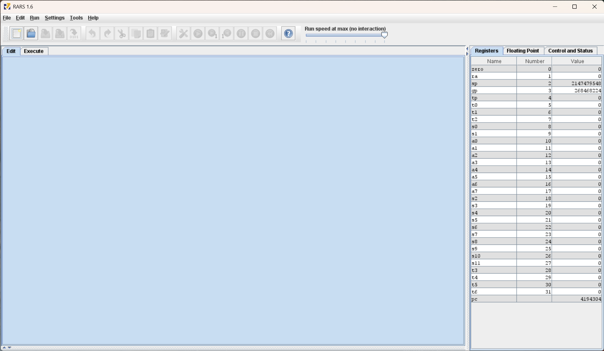

/// caption
The RARS home screen
///

### Opening and assembling an `asm` file

From the RARS home screen, click File -> Open, and browse to the location where you have downloaded [`riscv_asm_sample.asm`](https://github.com/NUS-CS2100DE/labs/blob/main/lab_templates/week06/riscv_asm_sample.asm)

!!! tip

	The file browser in RARS is rather tedious to use. We recommend creating a blank folder, in an easy-to-navigate location, for just your asm files. If you keep your asm files in a folder with other files, we recommend starting their names with `asm`, to make them appear higher up alphabetically. 

Once the file is open, we see that some buttons become highlighted and clickable:

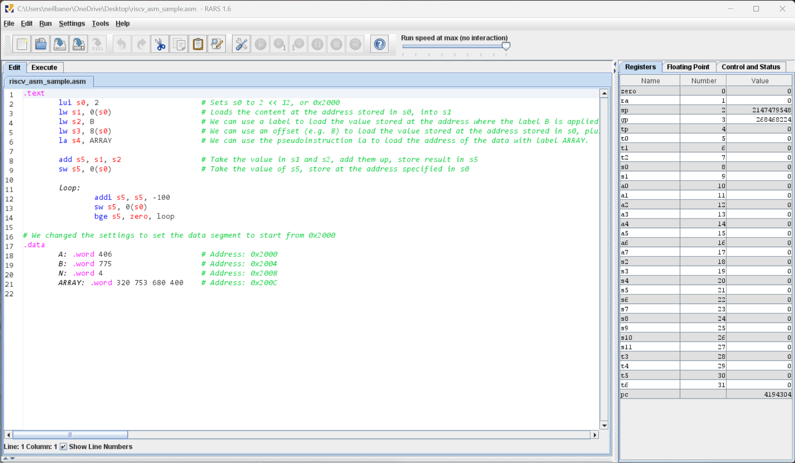
/// caption
The sample file opened in RARS
///

From here, we need to make some changes to our settings for the purposes of this course. Select "Settings" -> "Memory Configuration". The following window will pop up:

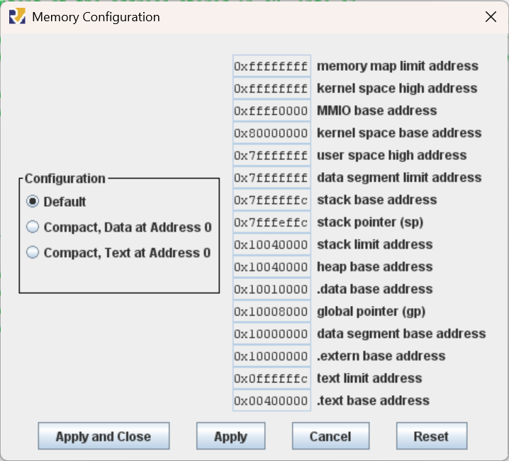{width=360px}

///caption
The RARS "Memory Configuration" popup
///

Here, choose "Compact, Text at Address 0", and click "Apply and Close". This means that the `.text` segment, where our code goes, should live at memory address `0x0`. The `.data` segment, where our variables live, will then be starting at address `0x2000`. When we select the "Compact, Text at Address 0" layout, the popup shows us the detailed memory map explaining this:

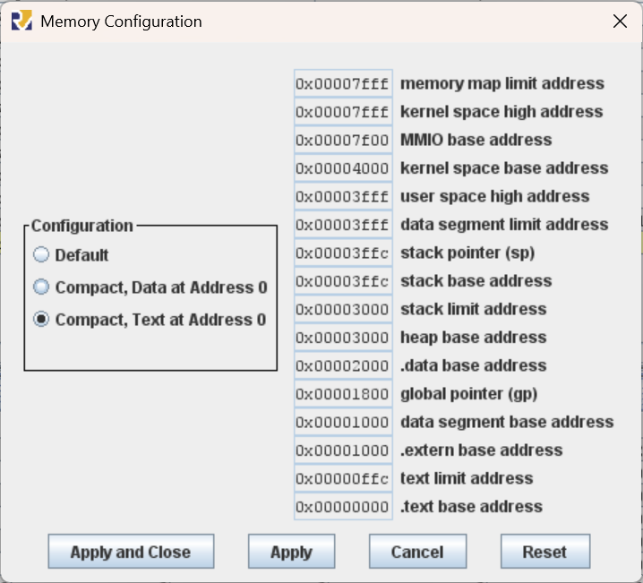

/// caption

The memory map we have selected, indicating that `.text` starts at `0x0` and ends at `0xffc`. It also shows that `.data` starts from `0x2000`. 

///

!!! warning
	Setting up the memory configuration correctly is **very important**. It will make our life much simpler when it comes time to finally implement our CPU. If we do not select this correctly, our program will not run on the CPU at all. 

To run the program in the simulator, we must first assemble it. Click on the "Assemble" button:

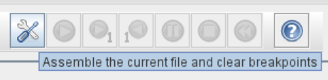

///caption

The "assemble" button in RARS

///

Once the file is assembled and ready to execute, we will see the "Execute" tab open automatically:

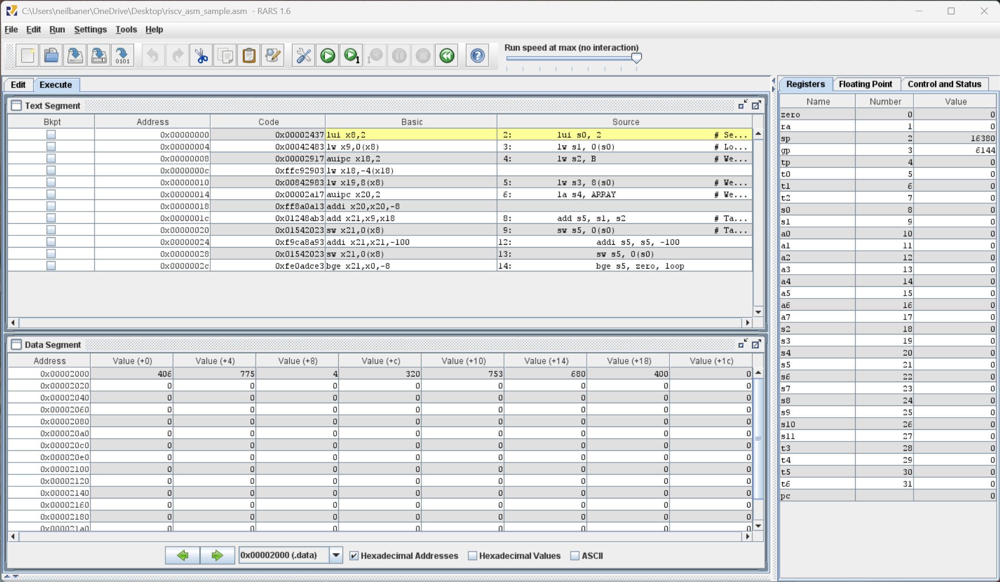

///caption

The assembled program in the "Execute" tab.

///

The important parts of the window are:

1. The "Text Segment" - this is the code that we have written, which we can execute all at once, or line by line. It also contains the machine code equivalent of each line of assembly (this should be familiar from this week's lecture). We will dive more into machine code in Week 7. The line highlighted in yellow indicates the line that will be executed next. 

2. The "Data Segment" - this is where our variables and memory can be monitored. We can see the contents of the entire memory in a tabular form. 

3. The "Registers" - this is a live view of the contents of each register. 

### Executing the code

We can run the code all at once using the "Run" button. However, in this case, it'll be much more useful to run the code line by line. We can use the "Run one step at a time" button to do this:

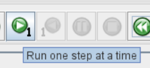

/// caption

The "Run one step at a time" button

///

Let us run the first line of our code: 

```asm linenums="2"
	lui s0, 2			# Sets s0 to 2 << 12, or 0x2000
```

To observe the effect of this instruction, we must direct our attention to the "Registers" tab:

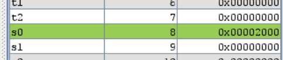

/// caption
Register `s0` loaded with `0x2000`. 
///

The next instruction is:

```asm linenums="3"
	lw s1, 0(s0)			# Loads the content at the address stored in s0, into s1
```

This will load the value stored at `0x2000` into the register `s1`. Observe the memory address `0x2000`. We use line 20 of the code to set it to `406`:

```asm linenums="20"
	A: .word 406 			# Address: 0x2000
```

Indeed, the "Data Segment" tab shows this:

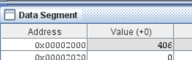

/// caption
The value 406 stored at memory address `0x2000`
///

!!! tip
	Untick (or tick) the "Hexadecimal Values" checkbox at the bottom of the "Data Segment" tab to switch the values in the "Data Segment" and "Registers" tabs between hexadecimal and decimal. Decimal may be useful for readability. 
	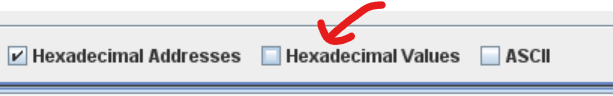


So, once we execute line 2, we see that `s1` is updated as follows:

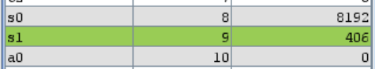

/// caption

Register `s1` loaded with the content of the memory at address `0x2000`.

///

Execute the next few lines of load instructions and observe the changes in the registers. We shall take the liberty of skipping forward to line 9, where we can observe a store instruction. 

```asm
	sw s5, 0(s0)			# Take the value of s5, store at the address specified in s0
```

At this point, the value stored in `s5` is `1181`:

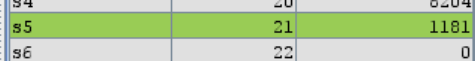

So, once the store instruction is completed, we expect memory address `0x2000` (the address stored in `s0`) to be updated to `1181`. Indeed, this is the case:

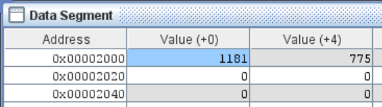

Continue to execute the program line by line. Try to predict the outcome of the lines 11 through 14, and then execute it to see if your understanding is correct. Observe as the branch instruction branches back to the label `loop` if the condition is met. 

## Warm-up activity

In [`loop.asm`](https://github.com/NUS-CS2100DE/labs/blob/main/lab_templates/week06/loop.asm), we have two memory addresses defined: `N` and `ARRAY`. Starting with memory address `ARRAY`, increment the value of `N` consecutive memory addresses by 2, 4, 6, ... That is, the address `ARRAY` should be incremented by `2`. `ARRAY+4` should be incremented by `4` and so on. This should be repeated `N` times. 

To help you, we have included two lines of code at the top, to load in `N` and the address of the first element in `ARRAY`, into `s0` and `s1` respectively:

```asm linenums="2"
	lw s0, N
	la s1, A
```

As the file name implies, you should use a loop to solve this question. By the end of execution, your data segment should look like this:

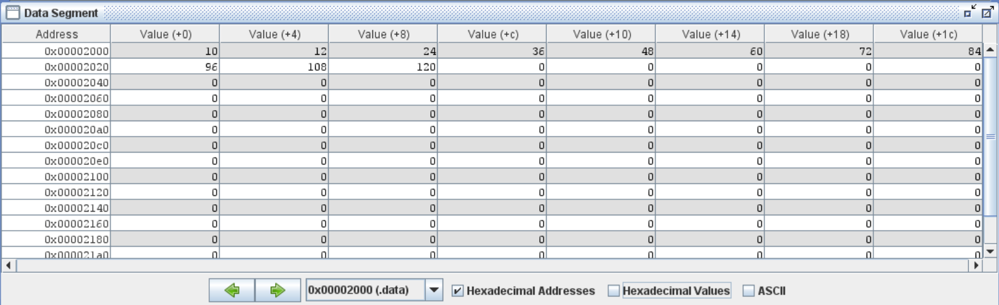

/// caption

The expected result of your code, in the memory (data segment).

///

!!! question "Question 1: Froot Loops 2.0 [2 points]"
	Finish the code in `loop.asm`. 

## Main Assignment

In [`assignment4_2420.asm`](https://github.com/NUS-CS2100DE/labs/blob/main/lab_templates/week06/assignment4_2420.asm), we have defined two values: `N`, and `ARRAY`. `ARRAY` is an array of `N` items. Your task is to sort `ARRAY` in place, using a **bubble sort**. Other sorting algorithms will **not** be accepted. The sorted array should replace the original array in memory. 

If you have taken CS2040DE, you should be familiar with a bubble sort. If not, the absolutely legendary Dr. Steven Halim from SoC has a great tutorial on sorting algorithms available on [visualgo.net](https://visualgo.net/en/sorting?slide=7). 

When your program reaches the `jal halt` line, it should be finished. At that point, we will check the memory corresponding to the label `ARRAY`. It should contain the same elements as the original array, but sorted in **ascending order**. 

The expected outcome of the test case provided is the following:

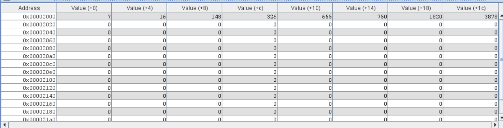

/// caption

The expected outcome from the test case we provided in `assignment4_2420.asm`

///

We will test this program with different test cases. Make sure your program can work on a variety of different inputs. 

!!! question "Question 2: The Sorting Hat [6 points]"
	Complete your code in `assignment4_2420.asm`. 

Here are some hints for you: 

1. Start by loading the value `N`, and *the address of* `ARRAY` into two registers. 
2. Set up the variables you will need, e.g. counters, in the saved registers. Write comments to remind yourself what each of the variables is supposed to do. 
3. Use a label to be able to branch back when you need to repeat an operation. 

## Concluding remarks

Congratulations on completing Lab 4! Remember to upload your solutions to Canvas before the deadline. If you need help, the [Discussions page](https://github.com/NUS-CS2100DE/labs/discussions) is the place to go. 

That's the last of the graded labs. In the second half of the semesters, the labs will be used for working on the project. 

!!! success "What we should know"
	* What an ISA is, and why the RISC-V ISA is particularly cool.
	* How and why assembly languages are used, and what makes them different to other languages like C or Python or JavaScript.
	* The different types of instructions we can use in RISC-V architecture.
	* How to use RARS to run our RISC-V assembly programs.
	* How to develop a full, somewhat useful, program with just RISC-V assembly.