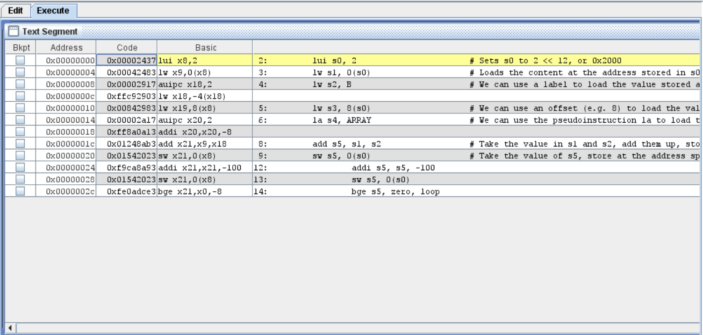

# Lab 5: Decoding RISC-V Instructions

Welcome back after (hopefully, a relaxing) recess week! Last time, we took a break from hardware design to write some RISC-V assembly code. This week, we will bring hardware back into the picture. We will create a couple of modules that can decode RISC-V machine language instructions, and in particular, extract the immediates and control signals. 

!!! info "Project Work"
	This manual is part of the final project. You do not need to write a report for this. You should work in your project groups. 

## Introduction

### From asm to 0s and 1s - RISC-V edition

We discussed last time that assembly language code maps very closely to machine code. This week, we will explore what exactly that means. 

In the first few lab sessions, we designed digital logic and learned how it works. No matter what, digital logic has inputs, and it performs some logical function on these inputs to produce outputs. 

A CPU is no different; it too is a logic block. It reads instructions from *instruction memory*, and performs a series of logical operations on the instruction to "execute" the code. 

When a CPU reads instructions, it has no understanding of the English language. Actually, it has no understanding of any programming language either; no, not even assembly language. To a CPU, the instructions are nothing but a series of bits. So, we need to convert our human-readable code to machine code that the CPU can understand.

Every instruction of assembly (pseudoinstructions notwithstanding) gets translated into a series of bits by a piece of software we call the "assembler"; so named because it "assembles" our assembly language code into machine code. This series of bits follows a given format for every different CPU architecture. 

??? note "How is Python/C/Java/JS code run on my CPU?"

	The concept of compilation and/or assembly of code in higher-level languages like Python or Java, is a very complex topic, and way out of the scope of this course. If you are interested in these topics, though, you should explore [CS4212: Compiler Design](https://nusmods.com/courses/CS4212/compiler-design) and [CS4215: Programming Language Implementation](https://nusmods.com/courses/CS4215/programming-language-implementation). 

For RISC-V, we classify instructions into 6 types, each with their own way of formatting the bits:

1. R-type: Used for data processing instructions where the source and destination operands are all registers. 
2. I-type: Used for data processing instructions where one of the sources is an immediate value, while the rest are registers.
3. S-type: Used for store instructions, which do not have a destination register.
4. B-type: Used for branching instructions, which also do not have a destination register. 
5. U-type: Used for the upper-immediate instruction `lui` and `auipc`. These have a destination register and a large 20-bit immediate. (In fact, this instruction type allows the largest immediate values, hence why it's so useful). 
6. J-type: Used for `jal`. Also has a destination register and a large immediate. 

Each word of machine code has a number of different fields:

1. `opcode`: used by every instruction. This defines what type of instruction we are seeing.
2. `funct3` and `funct7`: `funct3` is used by R-, I-, S-, and B-type instructions. `funct7` is only used by R-type instructions. These define the specific instruction we want to execute, within the type set by the opcode. 
3. `rd`, `rs1`, `rs2`: the destination, source 1 and source 2 registers for the instruction (where applicable). RISC-V has 32 general-purpose registers, labelled `x0` through `x31`. Each of rd, rs1 and rs2 are a 5-bit value indexing the register they refer to. E.g. `5b10101` == 21, so we are talking about `x21`. 
4. `imm`: used by every instruction type except R. Used to encode the immediate value used, in twos complement signed format. 

The table provided in the RISC-V Reference Card (available on [Canvas](https://canvas.nus.edu.sg/courses/69908/files/folder/Lecture%20Notes?preview=6099376), or online at https://www.cs.sfu.ca/~ashriram/Courses/CS295/assets/notebooks/RISCV/RISCV_CARD.pdf), shows how the bits are arranged for each type of instruction, as well as the encoding (i.e. what values mean what). 

Open up RARS, and then open `riscv_asm_sample.asm` from last time. Click the "Assemble" button to assemble the file and open the "Execute" tab. It should look like something like this: 



/// caption 

The assembled code for `riscv_asm_sample.asm`

///

Notice the "code" column. Consider a simple instruction like `add s5, s1, s2`. The encoding for this instruction should be:

| Field | Value 	| Explanation 			| 
|-------|-----------|-----------------------|
|opcode | 0110011	| R-type instruction	|
|rd		| 10101		| Register `x21`		|
|funct3 | 000		| `add` instruction		|
|rs1	| 01001		| Register `x9`			|
|rs2	| 10010		| Register `x18`		|
|funct7	| 0000000	| `add` instruction		|
|imm	| N/A		| R-type instruction	|

So, we should get `32b00000001 00100100 10001010 10110011`, or `32h01248AB3`. Indeed, cross-checking with RARS, we see that this is correct. 

As another example, consider `addi s5, s5, -100`:

| Field | Value 		| Explanation 			| 
|-------|---------------|-----------------------|
|opcode | 0010011		| I-type instruction	|
|rd		| 10101			| Register `x21`		|
|funct3 | 000			| `addi` instruction	|
|rs1	| 10101			| Register `x21`		|
|rs2	| N/A			| I-type instruction	|
|funct7	| N/A			| I-type instruction	|
|imm	| 111110011100	| 12-bit immediate -100	|

This should be `32b1111 1001 1100 1010 1000 1010 1001 0011`, or `32hf9ca8a93`. Once again, this is the same as we find in RARS. 

Try to calculate the machine code for the following instructions by hand:

1. `xori x24, x12, 20`
2. `lw x12, 4(x23)`
3. `sltu x2, x5, x6`

Then, type these instructions in RARS and verify that your calculations are correct. 

## Decoding instructions in hardware

In this lab, we will attempt to recreate the instruction decoder and the immediate extension modules we saw in the lectures. 

Open Vivado and create a new project, using the same settings as we have been using so far. Remember to choose the correct part number, and import the correct constraints file. 

Import [`Decoder.sv`](https://github.com/NUS-CS2100DE/labs/blob/main/lab_templates/week07/Decoder.sv) and [`Extend.sv`](https://github.com/NUS-CS2100DE/labs/blob/main/lab_templates/week07/Extend.sv) from Github, and import them into your project. For now, we won't have a `Top` module. We'll get to that in a couple of weeks. 

### Activity 1: The immediate extension unit

Let's start with the simpler of the two files, `Extend.sv`. Remember how different instruction formats have different ways to encode the immediate values. The Extender module should pick out the right bits, in the right order, from the instruction, and sign-extend them correctly. Remember, all immediates in RISC-V must be sign-extended to maintain their positive/negative sign. 

??? note "What is sign extension?"
	Sign-extension allows us to retain the sign of an m-bit binary number when it is extended to an n-bit binary number (n > m). 

	Consider the 4-bit twos complement number `4b1011`. This represents -5. If we blindly extend this to 8 bits with 0s in the upper bits, we get `8b00001011`, which represents 11. 

	Sign extension solves this problem, by using the MSB to fill the upper bits. That is, if the MSB (sign bit) is 1, the upper bits are all set to 1. If the MSB is 0, the upper bits are all set to 0. So, `4b1011` would become `8b11111011`, which is still equal to -5.  

Remember that there are five kind of instructions in RISC-V that use immediate values. Each of them encode the immediate slightly (or very) differently. 

The input `instr_imm` represents the upper 25 bits of the instruction word. For any instruction, the opcode is stored in the lowest 7 bits, so the immediate is guaranteed to be within these 25 upper bits. 

The input `imm_src` represents the kind of instruction that is being executed. Depending on this, the way the immediate is encoded is different. 

The output `ext_imm` should hold the sign-extended immediate that we calculated. 

### Activity 2: The instruction decoder

Now, let's move on to the more complex one, the instruction decoder. 

The sole input to this module is the complete instruction to be executed. The outputs are `PCS`, `jump`, `mem_to_reg`, `mem_write`, `alu_control`, `alu_src_b`, `imm_src` and `reg_write`. 

The purpose of each of these outputs is detailed in Lecture 7's slides. To summarize:

1. `PCS`: Used to determine the behaviour of the program counter: +4, branch, or jump. 

2. `mem_to_reg`: Used to ascertain if the output from the memory should be stored in a register. 

3. `mem_write`: Used to determine whether we should read from, or write to, the memory. 

4. `alu_control`: Used to determine the operation performed by the ALU.

5. `alu_src_b`: Used to control the second source of the ALU (reg vs imm). 

6. `imm_src`: Used to determine the format of the instruction, and therefore, its immediate encoding.

7. `reg_write`: Used to determine whether we should write a value to the register file. 

The width of the input and outputs has not been specified in the skeleton file. 

!!! tip
	You will notice that `imm_src` goes from the `Decoder` to the `Extend` module in the block diagram for a simple single cycle processor in the lecture notes. Indeed, the `imm_src` in this file will later connect to the `imm_src` input of the `Extend` module. So make sure the output of `imm_src` matches what `Extend` expects. 

We recommend following these steps to complete the `Decoder` module:

1. Complete the `assign` statements on lines 39-41 so that the logic values `opcode`, `funct3` and `funct7` reflect those components of the instruction. This will make it easier to use these bits later, as they will be used quite a few times. 

2. Determine the bit width required for each of the outputs of the decoder, and update the code accordingly. 

3. Now, for each of the outputs, write the logic required to set that output. Write the code inside the `always @(instr) begin ... end` block. This allows us to use constructs like `case ... endcase` statements in combinational logic. We should also use the ternary operator `? :` where possible to do so elegantly. 

### Activity 3: Simulation

Yes, you know it; it's time for simulation tests. For this time, we will have a skeleton file to use: [`Decoder_Extend_sim.sv`](https://github.com/NUS-CS2100DE/labs/blob/main/lab_templates/week07/Decoder_Extend_sim.sv). Download and import this simulation source into the Vivado project. 

Change the widths of the different signals to match those that we used in the `Decoder` and `Extend` modules. 

Inside the `initial begin ... end` block, we have included one test case for you: 

```SystemVerilog linenums="57"
		instr <= 32'hFF8A0A13; // corresponds to addi x20, x20, -8
		#10;
```

This is the machine code for the assembly instruction `addi x20, x20, -8`. Verify that the outputs of all the signals are as expected. Also, make sure that the immediate output from the `Extend` module (i.e. `ext_imm`) is correct. 

You should also test plenty of other instructions, to make sure that the decoding works correctly for every type of instruction. 

!!! tip
	Right click on the `ext_imm` waveform and set the radix to `Signed Decimal` for a human-readable interpretation of the decoded immediate. 

## Concluding remarks

!!! success "What we should know"
	1. How assembly language maps to machine language in RISC-V.
	2. The different formats of RISC-V assembly instructions.
	3. How immediates are encoded in different types of instructions. 
	4. How to write SystemVerilog code to decode machine language instructions. 
