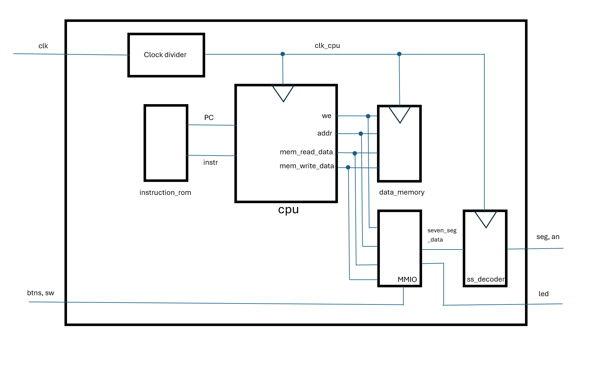
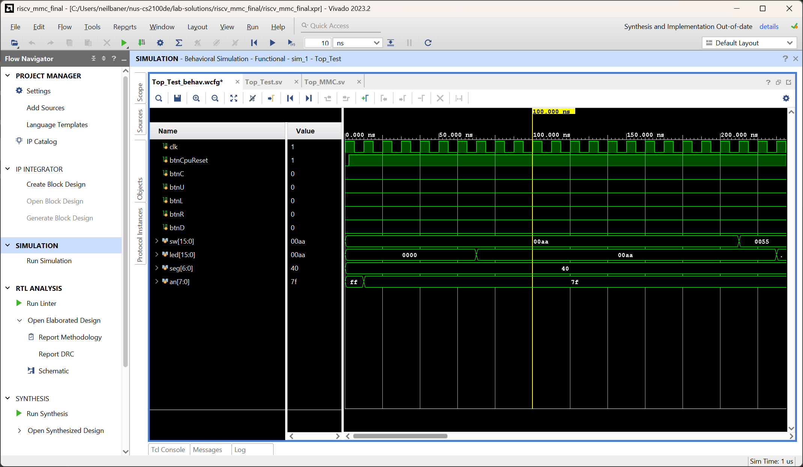
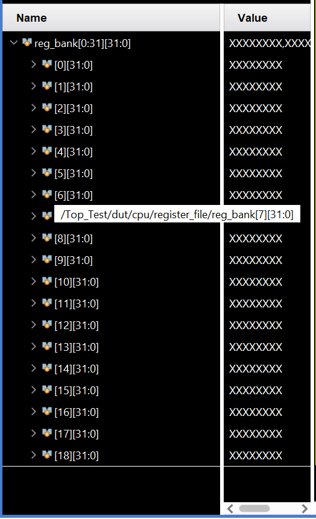
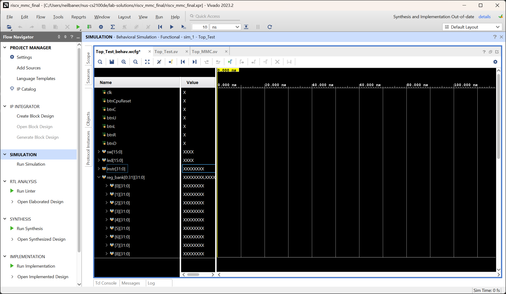
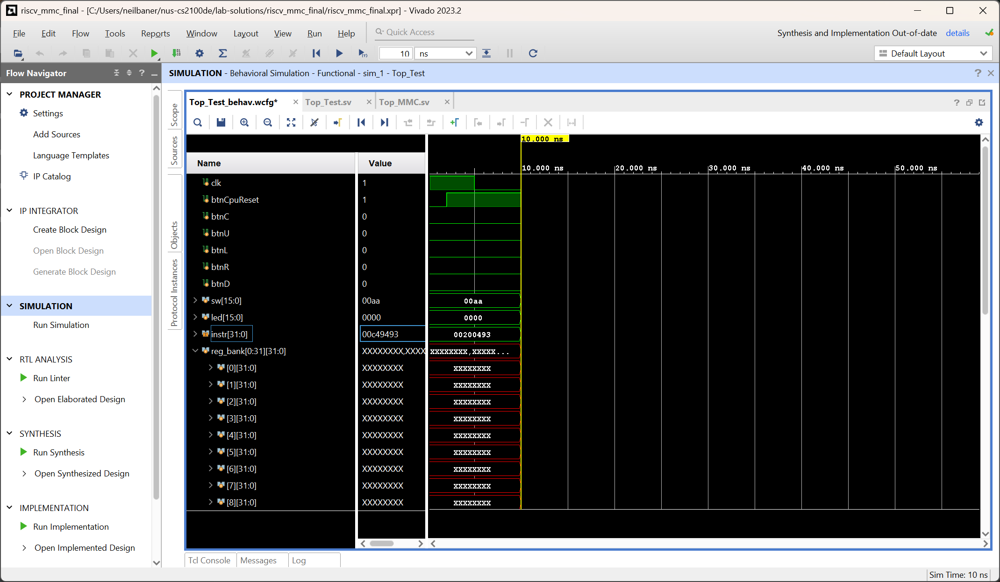
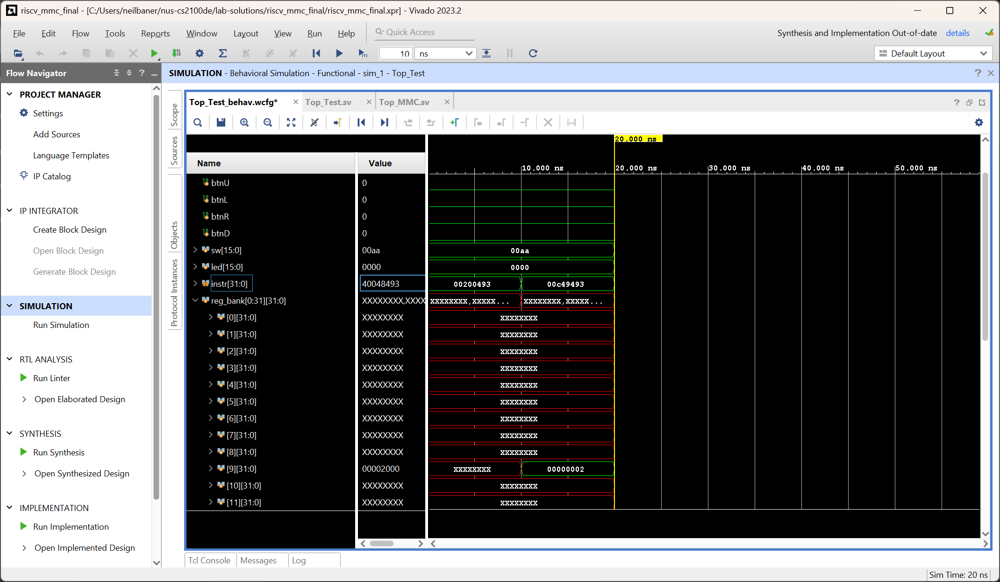
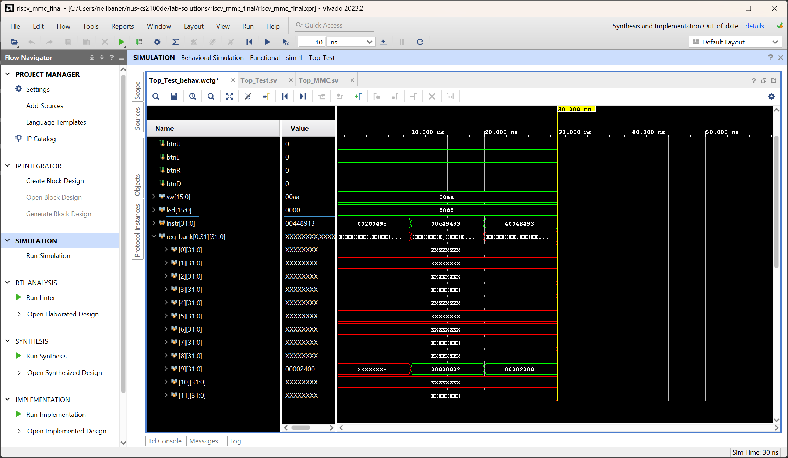
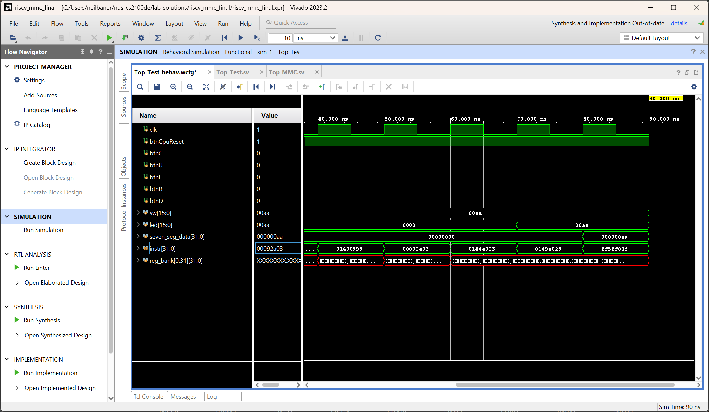

# Lab 8 : The Finale - Running Programs on our CPU

Welcome to the final lab for CS2100DE! We're finally there, the promised land - our CPU is ready to run real programs! Now, we just need to debug any issues remaining, and we will be good to go. 

!!! info "Project Work"
	This manual is part of the final project. You do not need to write a report for this. You should work in your project groups. 

## Introduction

### The Overall Architecture

The figure below shows the architecture of our final CPU project:



`Top_MMC.sv` is where our CPU, `RISCV_MMC` is instantiated. In the Top module, we have the following elements:

1. Our instruction and data memories, `instruction_rom` and `data_memory`. These are loaded from `.mem` files that we can generate right from RARS. 

2. A clock divider. This slows down the clock speed of our CPU, as we haven't pipelined the design and therefore can't run at 100 MHz. 

3. The Seven-Segment display decoder `ss_decoder` , to be able to use the 7-segment displays in our programs. 

4. Our CPU, aptly named just `cpu` :D

### Memory-Mapped IO, or MMIO

To be able to do something interesting with our CPU, we need to be able to communicate with peripherals outside of the CPU. For us, these are the ones on the board that we have already interacted with - the LEDs, DIP switches, 7-segment displays and push buttons. They're simple, but they can be used for a lot of interesting things!

The following table shows the memory map of our RISC-V CPU:

| Address range 		| Read/Write 	| Purpose 				| Notes														|
|-----------------------|---------------|-----------------------|-----------------------------------------------------------|
|`0x0000`-`0x00FF`		| Read only 	| Instruction memory	| 															|
|`0x2000`-`0x20FF` 		| Read/Write 	| Data memory 			|															|
|`0x2400` 				| Write only 	| LEDs 					| `led[15:0]` stored in lower 16 bits						|
|`0x2404` 				| Read only		| DIP switches			| `sw[15:0]` stored in lower 16 bits						|
|`0x2408`				| Read only		| Push Buttons			| `{btnC, btnU, btnL, btnR, btnD}` stored in lower 5 bits	|
|`0x2418`				| Write only	| Seven Segment Display | Hex representation of this value is displayed				|

MMIO works by allowing us to write data to, or read data from, memory addresses to control peripherals. For example, suppose we store the value `0xF0F0` at memory address `0x2400`. Then, the LEDs on the board will light up in the pattern `1111000011110000` (where `1` represents a lit LED and `0` represents an unlit one). 

For the seven-segment display, we do not need to do any decoding; we have built a module for that already. We may simply write a value to memory address `0x2418` and it will be displayed in hexadecimal format on the displays. Magic!

### Setting up the project

Download the files [`Top_MMC.sv`](https://github.com/NUS-CS2100DE/labs/blob/main/lab_templates/week11/Top_MMC.sv) and [`SevenSegDecoder.sv`](https://github.com/NUS-CS2100DE/labs/blob/main/lab_templates/week11/SevenSegDecoder.sv) Add them to the project. 

Download the file [`Nexys-4-Master-2100.xdc`](https://github.com/NUS-CS2100DE/labs/blob/main/lab_templates/week11/Nexys-4-Master-2100.xdc) from the repository too. Import it into the project as well. Do not use the same constraints file as we did before. 

To import [`AA_IROM.mem`](https://github.com/NUS-CS2100DE/labs/blob/main/lab_templates/week11/AA_IROM.mem) and [`AA_DMEM.mem`](https://github.com/NUS-CS2100DE/labs/blob/main/lab_templates/week11/AA_DMEM.mem), we need to use "Add Design Sources" and change "Files of type" from "Design Source Files" to "Memory Initialization Files", so that they appear in the browser for us to select. 

Take a look at lines 56 through 64 of `Top_MMC.sv`. 

```SystemVerilog linenums="56"
    // ONLY FOR SIMULATION - COMMENT OUT FOR HARDWARE IMPLEMENTATION!!!
//    assign clk_cpu = clk; 

    // ONLY FOR HARDWARE IMPLEMENTATION - COMMENT OUT FOR SIMULATION!!!
    assign clk_cpu = counter[3];
    
    always @(posedge clk) begin
        counter <= counter + 1;
    end
```

To run simulation for our CPU, we must *uncomment* line 57 and *comment* lines 60-64. To run synthesis and implementation, we must do the opposite: *comment* line 57 and *uncomment* lines 60-64.

For our CPU, the critical path is too long to use the 100 MHz clock speed. (How can we fix that?) So, we need to slow the clock down using a clock divider. We use a 4-bit counter, so our clock runs at 100 MHz / 16 = 6.25 MHz. 

For the simulation, if we leave the clock divider in, we can still see what we need to see, but the simulation will be 16 times longer than it needs to be. So, we simply bypass the clock divider to run the CPU with the `clk` signal itself. In behavioural simulation, we don't have any concept of a critical path, so we can use as fast or as slow a clock as we please. 

## Activity 1: Simulating our CPU

Download [`Top_Test.sv`](https://github.com/NUS-CS2100DE/labs/blob/main/lab_templates/week11/Top_Test.sv) from the repository and import it into your project as a simulation source. In a refreshing change of pace, the simulation is, this time, completely ready-made for us - how convenient!

Remember to set `Top_Test` as the Top module for simulation, before running Behavioural Simulation. 

And now, we are ready to run Behavioural Simulation. When we do that, we will get a scary looking, massive waveform like the one shown below:



Don't panic! This is a lot of information, to be sure, but we don't need to look at all of it all the time. To verify that our CPU is working correctly, we can observe just the registers on the CPU, and validate that they produce the same values as the RARS simulator. 

Open [`riscv_assembly_demo.asm`](https://github.com/NUS-CS2100DE/labs/blob/main/lab_templates/week11/riscv_assembly_demo.asm) in RARS and simulate it to observe the registers. Make sure that the behaviour is as expected. 

Then, come back to Vivado. In the Simulation view, open the "Scope" pane. Expand the `Top_Test` -> `dut` -> `cpu` -> `register_file` module. From there, we can see the `reg_bank` - drag this into the waveform. While we are here, we should also drop the `instr` from the `dut` module. The rest of the waveforms can be added later when needed for debugging, or we can add them now. The screenshots below will only show the ones mentioned. 

We can expand the register bank to see the content of each register:



The registers may display `XXXXXXXX` as the value - that's fine! Until the running program writes something to the register, its value is undefined by design, so the `X`s are normal and expected. 

Now, click the button to restart the simulation from time 0. Remember, this is not the "Relaunch" button - that's not what we want now. 



Set the step length on the top to 10 nanoseconds:

Now, use the Run for 10 ns button to run exactly one clock cycle. The first cycle may not show any useful data because we are still resetting the CPU. 

We should see that `instr` contains the first instruction from our program, which, for the demo, is `32'h00200493`. This corresponds to `addi x9, x0, 2`. So, we should be storing the value `32'h2` inside `x9`. 



Run another 10 nanoseconds, and we now observe that `reg_bank[9]` contains the number `2`. 



The next instruction is `32'h00C49493`, corresponding to `slli x9, x9, 12`. We expect to see that `reg_bank[9]` contains the value `32'h2000` now. Skipping forward another step, we see that this is indeed the case. 



Continue observing the waveform. If something is amiss, start debugging. 

Remember, the program reads from the switches, and writes to leds. This is the behaviour we expect to see in the simulation. We see that we set `sw <= 32'hAA` initially. So, we expect to see this word being written to the LEDs after cycle 6, and to the seven-segment display after cycle 7, as follows:



If the CPU can run the full simulation as expected, congratulations! We're ready to put the CPU on our FPGA and watch it go. The labour of our past 7 labs will finally bear fruits, and we will see our very own CPU running our very own program!

!!! tip
	If, as is highly likely, the CPU doesn't work as expected first try, breathe - this is normal. 

	First, check what instruction it is failing to execute. Think about the data path for that instruction type, and then, add all the relevant signals to the waveform to debug. For example, for an I type instruction, we may want to look at `ext_imm` to check if it is being properly constructed. If not, we can figure out which modules need tweaking. 

## Activity 2: The Grand Finale: Running our CPU on the FPGA

This is it - this is the moment we've been waiting for! The steps are the same as we've done a dozen times already - run Synthesis, Implementation, and finally, generate the bitstream and upload it to the FPGA. 

The included program is very simple; it simply takes the binary value input using the DIP switches, and displays it as a binary number on the LEDs, and as a hexadecimal number on the 7-segment displays. If it works correctly, congratulations! We have finished the project. 

!!! tip
	If the design works correctly in simulation but not on hardware, this is unusual but not unprecedented. The teaching team themselves have spent many an hour debugging such issues. 
	
	The best thing to do here is to check all the warnings generated by Vivado, for each stage (synthesis, implementation, bitstream generation). These usually hold the key to solving the problem. 

## Activity 3: Writing our own programs for the CPU

!!! info "Optional Activity"
	This activity is not necessary for the final demo. Rather, it is for your own exploration and learning. However, being able to follow this section may help you understand the CPU better, and in turn, help you in the Q&A part of the demo session. 

We can also write our own programs for the CPU, using RARS to write RISC-V assembly, converting the program to hexadecimal text, and dropping that text into the `AA_IROM.mem` and `AA_DMEM.mem` files. In theory, it is also possible to use assembly files generated by a compiler, which takes C (or some other compiled language) and converts it to RISC-V assembly. We simply need to convert them to hex format and paste their contents in the two aforementioned files. 

!!! warning "Not all instructions will work!"
	Our CPU implements a lot of instructions, but skips a few fairly important ones:

	1. `jal` and `jalr` - `jal` works but it doesn't save a return address. `jalr` is not implemented at all. This means that our CPU cannot execute any code with these instructions, and therefore cannot execute functions. 

	2. `auipc` and `lui` - these allow us to load larger numbers than 12-bit very easily into registers - useful for addresses (eg. for MMIO). In their absence, compiled code may not work, but we can always use a combination of `addi` and `slli` to achieve a similar effect. 

	3. Multiplication and division - these are not part of the RV32I instruction set. We would need to implement a multiplier to have these functions. 

	All of these are implemented in CG3207, so do return for that course if you're interested in these!

Here are the steps to put our RISC-V assembly code from RARS on to the board:

1. Create or open an assembly file with a program in it, in RARS. Make sure to set the Memory Configuration in Settings -> Memory Configuration, to "Compact, Text Address at 0". 

2. Click the button to assemble the program. We should see the "Execute" tab. 

3. Click the "Dump Memory" button to dump the instruction and data memory to files. The following dialog box should appear:

	Here, we select the text section first, and set the output to "Hexadecimal Text". Then, click "Dump to File...", and select a location and filename. 

	Repeat this step for the data section. 

4. Open the instruction memory and data memory dump files created in Notepad or some other text editor. Copy the content of the instruction memory file, and paste it into `AA_IROM.mem` in Vivado. Do the same for the data memory file, and paste it in `AA_DMEM.mem`. 

5. Relaunch synthesis, implementation and bitstream generation. 

!!! question "Question 1: Run it back [0 points]"
	Write RISC-V assembly programs to replicate the functions performed by Lab 1 and Lab 3. 
	
	1. The first program should take the input from the switches, and add up the value input by the left 8 and right 8 switches. Display the sum on the LEDs as a binary value. As an additional exercise, display the difference (subtraction) on the 7-segment displays. 
	
	2. The second program should run 3 independent counters, at a rate that is visible to the naked eye. The buttons and switches should be used to reset and change the direction of the counters as it was done in Lab 3. This is a very tricky exercise, for sure - it might be quite a few lines of code!

	You may use these programs to demonstrate your CPU next week. However, it is strictly not necessary, and the simple demo provided is sufficient. 

## Concluding Remarks

Congratulations on completing the labs for CS2100DE! No, really, congratulations - we have successfully built a full, working CPU running on our FPGA, which can run RISC-V programs! This is no small feat, and genuinely worthy of high commendation. The only thing remaining now is to come to the demo next week and show the teaching team what you know. All the best for that, and for finals!

!!! success "What we should know"
	* How to debug a reasonably complex design on an FPGA.
	* How MMIO is used to communicate with peripherals.
	* How to build and run a complete, working CPU on an FPGA.