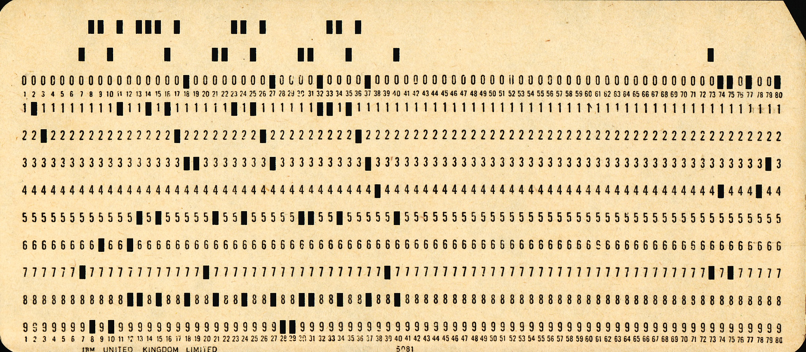
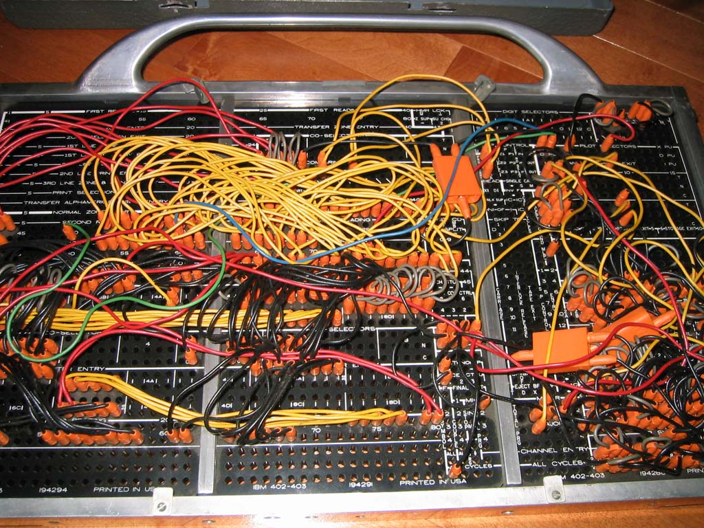
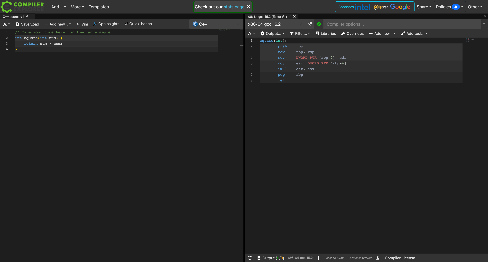
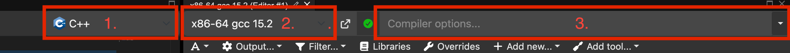

# Lab 8: Writing Programs for our CPU

Welcome to the final structured lab for CS2100DE! Today, we will change gears a little, and understand how modern computer programs that we write in languages like Python and C, really work. 

!!! info "Project Work"
	This manual is part of the final project. You do not need to write a report for this. You should work in your project groups. 

## What Is A Program?

By now, we have all written many, many computer programs. They're like recipes for our computer to follow, to process inputs and cook up interesting outputs for us. But how exactly do programs work? How do we go from a program written in a fairly human-readable language, to the binary machine code that our CPU understands? To better understand how a modern computer program works, let's take a stroll down memory lane, and explore the history of programming computers. 

### Before Programming Languages

Believe it or not, computers actually significantly predate even the earliest of programming languages (as we know them today). The very earliest of computers had to be programmed directly with machine code, that the computer could understand. This was done in a variety of ways: many early computers used punch cards [^1]...



/// caption

By Pete Birkinshaw from Manchester, UK - Used Punchcard, CC BY 2.0, https://commons.wikimedia.org/w/index.php?curid=49758093

///

...while some like the IBM 402[^2] were "programmed" by plugging wires connecting different pins to each other on a plugboard. I would *not* want to be debugging that.



/// caption

CC BY 2.5, https://commons.wikimedia.org/w/index.php?curid=522789

///


[^1]: [https://www.ibm.com/history/punched-card](https://www.ibm.com/history/punched-card)
[^2]: [https://www.columbia.edu/cu/computinghistory/402.html](https://www.columbia.edu/cu/computinghistory/402.html)

### Assembly Language

We are all familiar with the RISC-V assembly language, and have a rough idea of how it works - every instruction we write gets converted to one (or maybe many, for pseudoinstructions) machine language instruction. It is a very precise way of writing programs for our computer. 

The first ever assembly language was described for the "Automatic Relay Computer"[^3]. Of course, computers back in *checks notes* 1947 were significantly more primitive than the ones we have now, and we didn't have text editors and simulators and IDEs to write assembly programs, so the experience was very different from what we have today! Assembly languages started as merely a readable interpretation of machine language instructions, and later evolved to become languages that could be decoded automatically by a program known as the "assembler". 

Assembly languages are still used today - every modern (significant) microarchitecture has one, and applications where every last bit of performance matters still write parts in assembly language. For example, [FFMpeg](https://github.com/FFmpeg/FFmpeg), a very popular library for decoding and playing video files, uses assembly language for the more performance-critical parts. 

[^3]: [https://albert.ias.edu/server/api/core/bitstreams/d47626a1-c739-4445-b0d7-cc3ef692d381/content](https://albert.ias.edu/server/api/core/bitstreams/d47626a1-c739-4445-b0d7-cc3ef692d381/content)


### High-Level Languages

Assembly languages are super nice to have, but imagine having to do any and all programming with assembly language only - sounds painful, right? Thankfully, we do not need to do that anymore in the modern era, for we stand on the shoulders of giants that gave us all high-level programming languages that we know and love. 

One of the first high-level programming languages that saw widespread use was IBM's Fortran[^4] programming language. Fortran stands for **For**mula **Tran**slation; at the time, it was designed as a way for scientists to easily translate their formulae into a computer program for performing calculations. 

[^4]: [https://www.ibm.com/history/fortran](https://www.ibm.com/history/fortran)


#### Compiled Languages

Compiled languages are high-level programming languages that are "compiled", or translated to machine language, by a program called a "compiler". When we write a program in a compiled language, we must first compile it into a binary machine code file. If there are errors in our syntax, or our program is illegal in some other way, the compilation process will fail and we will not get a runnable binary file. Of course, the compiler cannot catch logic errors. 

!!! note
	This is a gross simplification of what a compiler does. Feel free to read online to understand the process in more detail, and if you so please, [CS4212](https://nusmods.com/courses/CS4212/compiler-design) teaches this in much more detail. 

Compiled languages are generally quite fast, since they can run directly on our hardware after compilation. However, the other side of the coin is that since machine code is specific to ISAs, compiled programs for one ISA will not run on other ISAs. For example, the [Zed code editor](https://zed.dev/download) ships both x86_64 versions (for Intel and AMD CPUs), as well as ARM64 versions (for Apple and Qualcomm CPUs), because the version for one system will not run on the other. 

Examples of compiled languages include C/C++, Rust, and Go. We will be using the C programming language for this lab, due to its popularity, legacy, and unmatched level of support.

#### Interpreted Languages

Interpreted languages are a little bit different. A program written in an interpreted language (like Python, JavaScript or Matlab) is not compiled into machine code directly. Instead, an "interpreter" reads the program directly, and runs it line by line. The interpreter is a compiled program, and it can read programs just like Microsoft Word can read documents. Since there is no compilation process, and the program runs lines one by one, there is no protection from syntax errors - you will only catch them when the interpreter runs the erroneous line of code! 

!!! note
	As in the previous section, this is also a gross oversimplification of how computer programs are interpreted. In practice, most languages use more complex approaches, such as "Just-In-Time Compilation", or compiling to "bytecode" (a sort of intermediate between a high-level language and machine code). [CS4215](https://nusmods.com/courses/CS4215/programming-language-implementation) explores all of this in more detail. 

Interpreted languages are generally slower than compiled ones. However, since a program written in an interpreted language is never translated directly to machine code, the same program can be used on every ISA with a working interpreter. As long as the interpreter has been ported to the ISA, all programs in that language can run on said ISA. 

## A Quick Intro to C

The following section assumes a reasonable familiarity with Python (which should be part of the CS1010* prerequisite). We will, with great brevity, explore the syntax of the C programming language, from the lens of a Python programmer. 

### Variables

Just like Python, C has variables. However, in C, every variable must have a predetermined "type" that specifies what kind of data the variable can hold. C also distinguishes between *declaring* a variable (i.e. specifying that it exists), and *assigning* a variable (i.e. setting its value). 

=== "Python"
	```Python
	x = 10
	```
=== "C"

	```C
	int x;	// declare that the program has a variable x, and x will contain a signed integer number
	x = 10;	// assign the value 10 to x
	```

Notice that in C, every line ends with a semicolon.

In C, we can combine the declaration and assignment of a new variable into a single line. Remember, a variable must only be declared once. 

```C
int x = 10;
```

Incrementing and decrementing a variable works the same way as Python, but with an added feature: we can use `++` or `--` to increment or decrement the value by 1. 

=== "Python"
	```Python
	x = x + 10	# set the value of x to x + 10
	x += 10 	# same as above
	```
=== "C"

	```C
	x = x + 10; // set the value of x to x + 10
	x += 10;	// same as above
	x++;		// set the value of x to x + 1
	```

### Loops

The syntax for loops in C is a bit different from Python. 

In C, we use curly braces instead of indentation to denote code that is within the loop and should be repeated. However, we still indent the code for readability. 

=== "Python"
	```Python
	# for loop
	for i in range(10):
		x += i
	# while loop
	while x > 10:
		x /= 2
	```
=== "C"
	```C
	// for loop
	for (int i = 0; i < 10; ++i) {
		x += i;
	}
	// while loop
	while (x > 10) {
		x /= 2;
	}
	```

Note that curly braces do not need to be followed by a semicolon. 

### Conditional Statements

The syntax for conditional statements, on the other hand, is quite similar between C and Python. 

=== "Python"
	```Python
	if i < 5:
		x += 100
	elif i < 10:
		x += 50
	else:
		x += 25 
	```
=== "C"

	```C
	if (i < 5) {
		x += 100;
	} else if (i < 10) {
		x += 50;
	} else {
		x += 25;
	}
	```

### Functions 

!!! warning "Functions are not implemented in our CPU!"
	In order to use functions properly, we need, minimally, to implement the full `jal` instruction, and preferably `jalr` too. These are not part of the base instruction set we have implemented for our CPU. 

	We can get around this problem by just avoiding the use of functions in our C program. If this feels too hacky for you, feel free to do it properly (maybe by tackling the root cause?)

Functions in C are defined similarly to Python. There is no need to use the `def` keyword to indicate that a function is being defined; however, the type of the variable returned by the function, and the type(s) of any function parameter(s) must be specified. If the function does not return a value, it can be declared as type `void`. 

The syntax for calling a function is almost identical, but C requires the trailing semicolon. 

=== "Python"
	```Python
	# defining a function
	def average(num1, num2): 
		return (num1 + num2) / 2
	# calling the function
	x = 2
	y = 6
	z = average(x, y)
	```
=== "C"

	```C
	float average(int num1, int num2) {
		return (num1 + num2) / 2;
	}
	int x = 2;
	int y = 6;
	float z = average(x, y);
	```

## Compiling C Code To RISC-V Assembly

Compiling and running C code is a somewhat involved and tedious process. In the interest of brevity, we will not cover in much detail how to run C code on your own laptop/desktop computer. If you are interested, feel free to ask any member of the teaching team, or search online, for more detailed instructions or guidance. The general steps are: 

1. Install a C compiler like gcc or clang; the steps for this vary by your preferred operating system. 
2. Use the command line to invoke your compiler, provide it your C program and any compiler options, and let it do its magic automatically. For example, with clang, we can say something like `clang program.c -o program`. 
3. ???
4. Profit (you now have an executable program that can run on your machine).

While the steps sound simple, there is a lot of tedium involved, which we don't really have time to get into too much. So, let us use a much simpler solution: the [Godbolt Compiler Explorer](https://godbolt.org/). 



Here, we can enter our C code in the editor panel on the left side of the window, and watch the website use our chosen compiler to produce assembly code on the right. Isn't that convenient?

Before we start, let us configure the compiler correctly, with the following settings:

1. Set the language to C (it may be C++ by default). 

2. Set the compiler to "RISC-V rv32gc clang (trunk)". 

3. Type in `-Os` for the "compiler options". 



///caption

The options in Godbolt Compiler Explorer that need to be set correctly. 

///


///caption

The correctly set options in Godbolt Compiler Explorer.

///

Once we are done, we can paste the following sample program into the editor. 

```C linenums="1"
// first, we write down the addresses of our devices
#define LED_ADDR 0x2400
#define DIP_ADDR 0x2404
#define BTN_ADDR 0x2408
#define SEG_ADDR 0x2418

int main() {
	// we store the addresses of our devices in pointer variables
    int* led_ptr = (int*)LED_ADDR; 
    int* dip_ptr = (int*)DIP_ADDR;
    int* btn_ptr = (int*)BTN_ADDR;
    int* seg_ptr = (int*)SEG_ADDR;
    while(1) {
		// we read the values from the push buttons and dip switches
        int btn_data = *btn_ptr;
        int dip_data = *dip_ptr;
        
		// we initialize variables that we will later write to leds and seven-seg
        int led_data_w = 0;
        int seg_data_w = 0;
        
        // DO NOT CHANGE THE CODE ABOVE
		// you may read the variables btn_data and dip_data, and write code that uses them
		// your code can change led_data_w and seg_data_w, which are displayed on leds and seven-seg later
		// write your code below this comment

        led_data_w = dip_data;
        seg_data_w = dip_data;

        // DO NOT CHANGE THE CODE BELOW

		// we write our chosen values to the leds and seven-seg
        *led_ptr = led_data_w;
        *seg_ptr = seg_data_w;
    }
}
```

Let's explore what this code does in more detail. 

In lines 2-5, `#define` is used to define a macro in C. The compiler treats this as a simple find-and-replace operation; i.e. wherever we write `LED_ADDR`, the compiler will replace it with `0x2400`.

In lines 9-13, we declare variables of type `int*`. `int*`, also known as pointer-to-integer, is a type for variables that hold the address of some integer values in memory. So, pointers are essentially just memory addresses. In our case, these addresses correspond to the MMIO peripherals. 

In lines 15-16, we read data from the MMIO peripherals, using the pointers we declared earlier. This is similar to doing `lw` in assembly. We can use the variables `btn_data` and `dip_data` in our program to know what input has been provided, and act accordingly. 

In lines 19-20, we declare and initialize two integer variables, which we will eventually write to the LEDs and seven-segment displays. We can change the value of `led_data_w` and `seg_data_w`, to indicate what we want displayed on the respective peripherals. 

In lines 33-34, we write the data from `led_data_w` and `seg_data_w` to the respective peripherals in MMIO. This is similar to doing `sw` in assembly. 

Lines 13-35 are wrapped in an infinite `while()` loop. This ensures that as long as our CPU is powered on, it will keep repeating what we have told it to do, and it won't run out of code to execute. 

Let's look back at Compiler Explorer. The corresponding output on the right side should be something like:

```asm linenums="1"
main:
        li      a0, 9
        slli    a0, a0, 10
.LBB0_1:
        lw      a1, 4(a0)
        sw      a1, 0(a0)
        sw      a1, 24(a0)
        j       .LBB0_1
```

!!! note
	Since we are using a "trunk" compiler, updates to the compiler may result in slightly different assembly code output. The functionality will be the same, though.

This is actually very elegant RISC-V assembly code to achieve the same function as our C code, and indeed, our program from last week. With only 6 instructions, it's very easy to follow - try drawing out the flow of the program on paper to understand what it's doing. 

Copy this RISC-V assembly code and paste it into RARS. If it doesn't assemble, add the line `.text` to the beginning of the program. Assemble and run it, and verify it is correct. Then we can follow the instructions from [Lab 7 Activity 3](https://nus-cs2100de.github.io/labs/manuals/07/lab_07/#activity-3-writing-our-own-programs-for-the-cpu) to use the code for our own CPU, and verify that it does indeed work on the hardware. 

!!! question "Question 1"

	Once we have verified that this minimal example works, we are ready to go as wild as our imagination allows. Write your own C code in the area specified in the program, then try and upload that to your CPU as you did above. Note the requirements in the [Grading page](../../grading.md); you will be graded based on the complexity and interestingness of the program you write. 

## Concluding Remarks

Congratulations! You have successfully built a proper, working computer, from bottom to top - starting from the gates and logic that make it work, all the way up to a program that it can run. This is, once again, decidedly a nontrivial achievement, and you should be very, very proud of yourself. 

Make sure that you are intimately familiar with **all** of your project, as you may be quizzed on any part of it, as specified in the [Grading page](../../grading.md). If you do so, you will be very well prepared to score a good grade for the project component of this course. All the best!